# User Interface Screens Overview

> **Figma UI Design:** [https://www.figma.com/make/M4oBqro4C0xRpbjKkpVFaK/Simple-Auth-for-Inventory-System?t=xN4GnleNv06fS01O-20&fullscreen=1](https://www.figma.com/make/M4oBqro4C0xRpbjKkpVFaK/Simple-Auth-for-Inventory-System?t=xN4GnleNv06fS01O-20&fullscreen=1)

UI có cả phiên bản cho web máy tính và mobile.

**Mockdata đăng nhập cho các vai trò:**

| Role                      | Username | Password |
|---------------------------|----------|----------|
| Manager                   | 1        | 1        |
| Quality Control Technician| 2        | 2        |
| Operator                  | 3        | 3        |
| IT Administrator          | 4        | 4        |

---

Tài liệu này mô tả các màn hình giao diện người dùng của hệ thống Inventory Management, được chia theo các role chính.

## 1. Auth Screens
### 1.1 Đăng nhập hệ thống

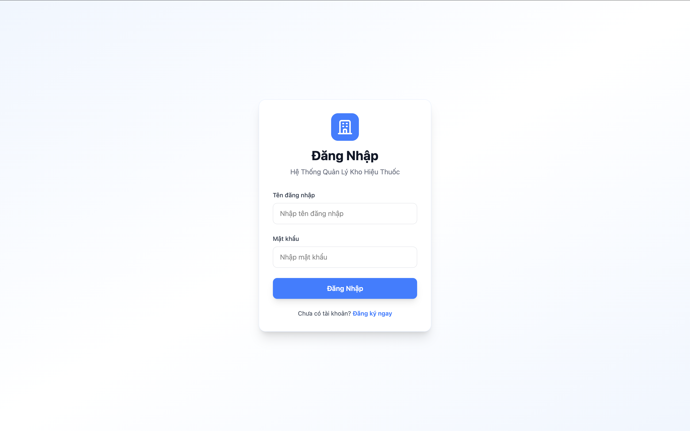

Màn hình đăng nhập cho phép người dùng nhập tên đăng nhập (username) và mật khẩu (password) để truy cập vào hệ thống. Giao diện gồm các trường nhập liệu, nút đăng nhập. Sau khi nhập thông tin hợp lệ và nhấn nút đăng nhập, hệ thống sẽ xác thực và chuyển sang giao diện chính nếu thành công.

---

### 1.2 Đăng ký tài khoản

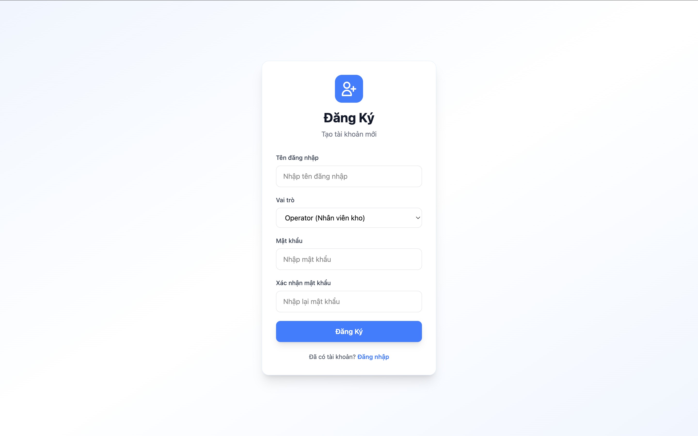

Màn hình đăng ký cho phép người dùng tạo tài khoản mới bằng cách nhập các thông tin như tên đăng nhập, mật khẩu, xác nhận mật khẩu và chọn role. Sau khi điền đầy đủ thông tin và nhấn nút đăng ký, hệ thống sẽ kiểm tra hợp lệ và tạo tài khoản mới cho người dùng.

---

## 2. Manager Screens

### 2.1 Dashboard Screen

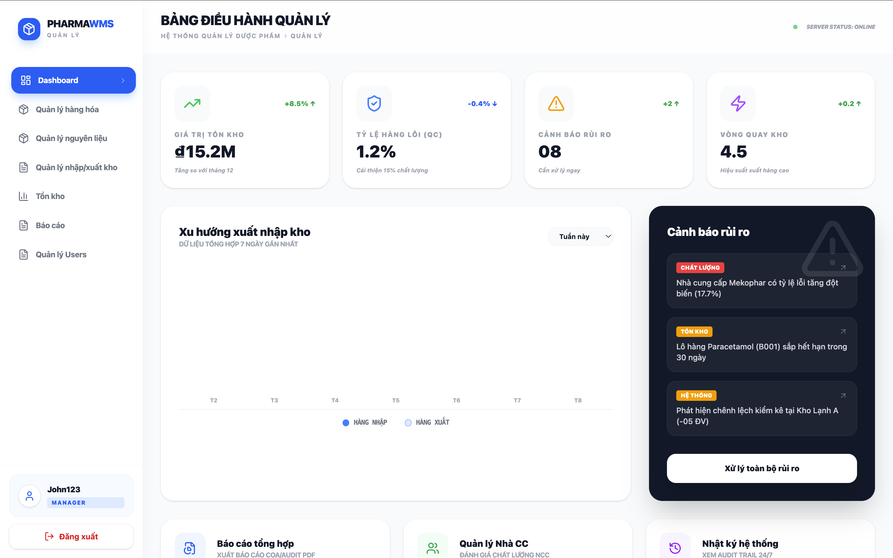

Sau khi đăng nhập với vai trò Manager, hệ thống hiển thị DashboardScreen để cung cấp cái nhìn tổng thể về giá trị tồn kho, tỷ lệ hàng lỗi và vòng quay kho. Biểu đồ trung tâm mô phỏng xu hướng xuất nhập kho trong tuần hoặc tháng, hỗ trợ nhà quản lý theo dõi biến động hàng hóa và dự báo nhu cầu lưu trữ. Khu vực cảnh báo rủi ro phía bên phải giúp nhận diện nhanh các mặt hàng sắp hết hạn hoặc chênh lệch kiểm kê cần xử lý gấp.

---

### 2.2 Inventory Screen

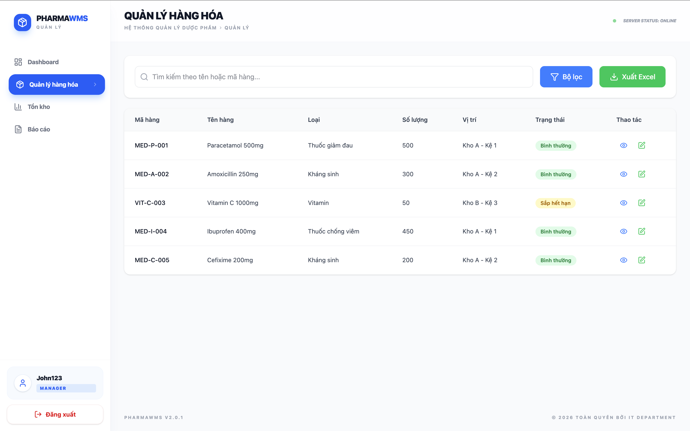

Khi nhấn vào mục "Quản lý hàng hoá" trên thanh điều hướng, người dùng truy cập InventoryScreen để thực hiện kiểm tra danh mục thuốc. Giao diện tích hợp bộ lọc và thanh tìm kiếm theo mã hàng hoặc tên thuốc để trích xuất danh sách hàng hóa phù hợp. Bảng dữ liệu hiển thị chi tiết số lượng, vị trí kệ và trạng thái thực tế, hỗ trợ xuất file Excel phục vụ công tác kiểm tra.

---

### 2.3 Detail Product Screen

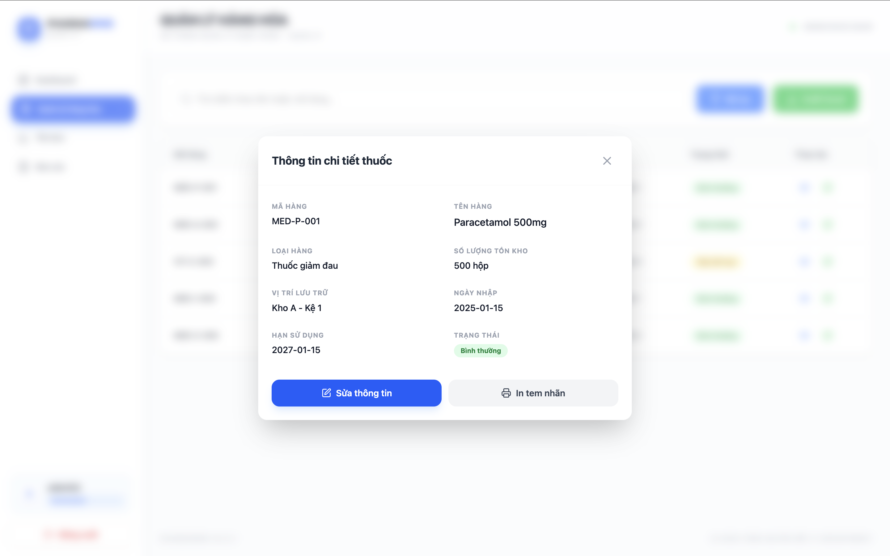

Khi chọn biểu tượng con mắt tại danh sách hàng hóa, hệ thống hiển thị DetailProduct dưới dạng cửa sổ modal cung cấp hồ sơ chi tiết của sản phẩm. Màn hình liệt kê rõ ràng vị trí lưu trữ tại Kho A, ngày nhập kho, hạn sử dụng và trạng thái để phục vụ việc đối chiếu thông tin. Manager có thể thực hiện in tem nhãn hoặc chuyển sang chế độ chỉnh sửa thông tin trực tiếp từ giao diện này.

---

### 2.4 Edit Product Screen

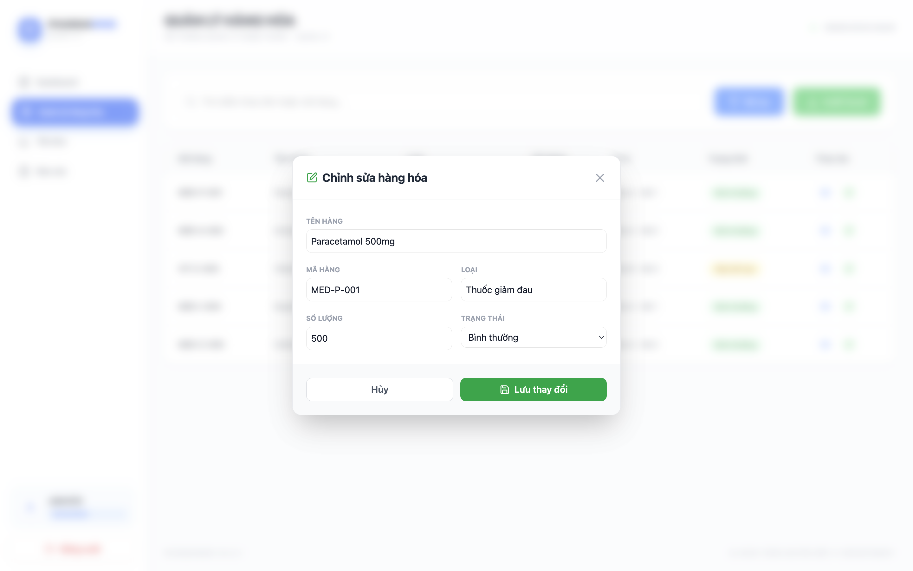

Người dùng chọn biểu tượng chỉnh sửa tại màn hình quản lý hàng hóa để mở giao diện EditProduct khi cần cập nhật dữ liệu sản phẩm. Giao diện cung cấp các trường nhập liệu tối giản để thay đổi tên thuốc, mã hàng, số lượng và trạng thái lưu kho. Thao tác nhấn "Lưu thay đổi" sẽ ghi nhận dữ liệu mới vào hệ thống, đảm bảo tính chính xác của hồ sơ hàng hóa.

---

### 2.5 Import/Export Management Screen

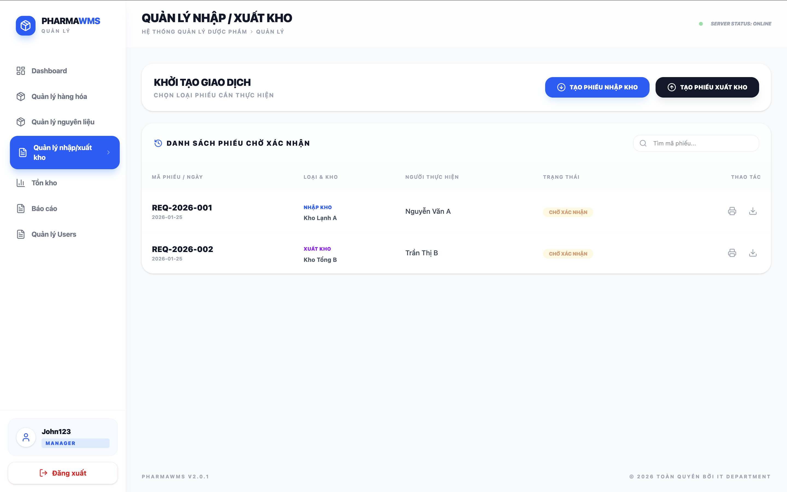

Khi người dùng nhấn vào mục "Quản lý nhập/xuất kho" trên thanh điều hướng, hệ thống hiển thị giao diện Import/Export Management để quản trị các yêu cầu điều chuyển hàng hóa tập trung. Màn hình cung cấp danh sách các phiếu đang ở trạng thái "Chờ xác nhận" kèm theo thông tin chi tiết về loại giao dịch, kho lưu trữ và định danh người thực hiện. Manager có thể sử dụng thanh tìm kiếm nhanh mã phiếu hoặc thực hiện in và tải xuống chứng từ PDF trực tiếp từ danh sách để phục vụ công tác lưu trữ hồ sơ pháp lý.

---

### 2.6 Create Import Screen

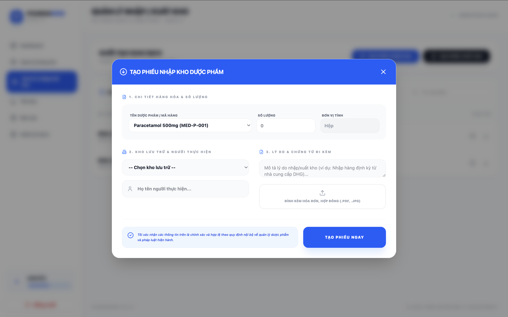

Giao diện Create Import xuất hiện dưới dạng modal khi Manager nhấn nút "Tạo phiếu nhập kho" để thực hiện quy trình tiếp nhận dược phẩm mới vào kho. Biểu mẫu yêu cầu khai báo đầy đủ thông tin về mã hàng, số lượng thực tế, vị trí kho lưu trữ mục tiêu và lý do nhập kho cụ thể. Hệ thống tích hợp tính năng đính kèm chứng từ (hóa đơn, hợp đồng) và yêu cầu xác nhận trách nhiệm về tính chính xác của dữ liệu theo quy định pháp luật trước khi hoàn tất khởi tạo.

---

### 2.7 Create Export Screen

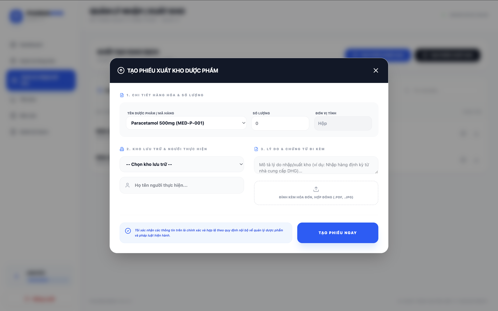

Khi chọn nút "Tạo phiếu xuất kho", màn hình Create Export hiển thị cho phép Manager thiết lập các lệnh giải phóng hàng hóa khỏi kho dược phẩm. Người dùng thực hiện lựa chọn danh mục thuốc cần xuất, chỉ định kho nguồn và bổ sung các tài liệu minh chứng như lệnh điều động hoặc hợp đồng cung ứng. Thao tác "Tạo phiếu ngay" sẽ ghi nhận giao dịch vào hệ thống ở trạng thái chờ xác nhận, đảm bảo mọi luồng hàng đi đều được kiểm soát chặt chẽ và lưu vết phục vụ kiểm toán.

---

### 2.8 Stock Screen

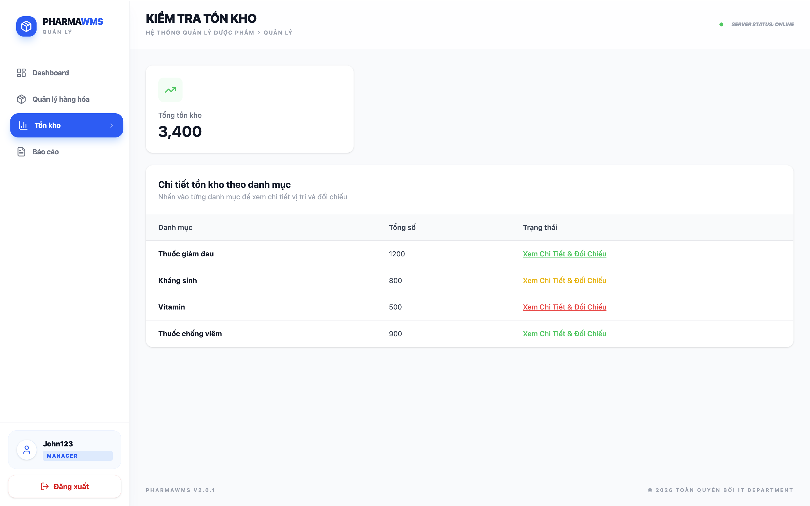

Truy cập mục "Tồn kho" trên navbar sẽ dẫn Manager đến StockScreen để theo dõi số lượng tồn hiện tại theo từng danh mục dược lý. Màn hình hiển thị tổng số tồn và nhãn trạng thái của từng nhóm hàng như thuốc giảm đau hay kháng sinh giúp xác định phạm vi cần kiểm tra. Đây là giao diện chính để theo dõi mức độ lưu thông và quản lý tồn kho tổng thể theo đúng quy trình pháp lý.

---

### 2.9 Stock Detail Screen

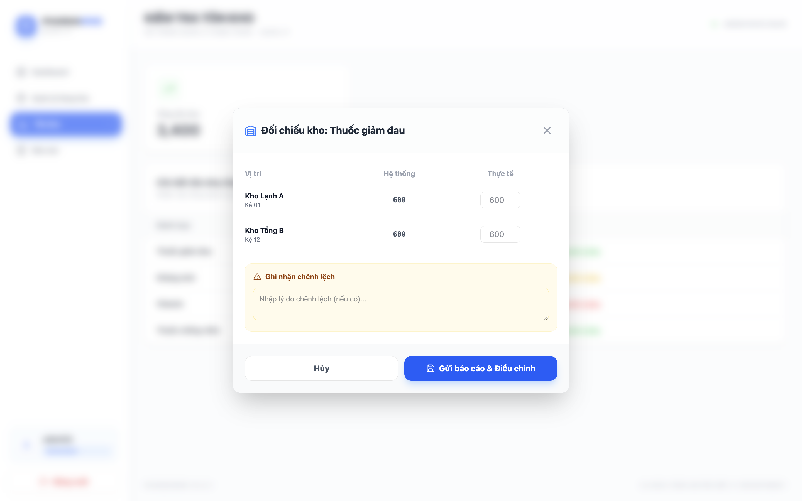

Khi nhấn vào "Xem chi tiết & đối chiếu" từ màn hình tồn kho, giao diện StockDetail sẽ hiển thị để thực hiện quy trình kiểm kê thực tế. Màn hình cho phép so sánh trực diện số liệu trên hệ thống với số lượng thực tế tại từng vị trí kho lạnh hoặc kho tổng. Manager có thể ghi nhận lý do chênh lệch vào khu vực ghi chú trước khi nhấn nút xác nhận điều chỉnh để cập nhật lại số tồn kho.

---

### 2.10 Report Screen

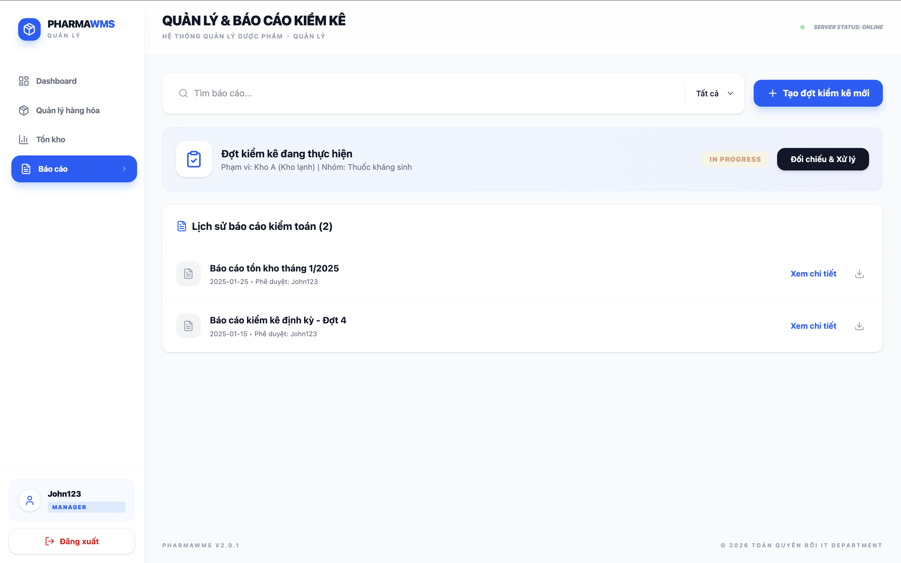

Khi chọn mục "Báo cáo" trên navbar, ReportScreen hiển thị danh sách các bản báo cáo tổng hợp về tồn kho, nhập xuất và doanh thu. Giao diện hỗ trợ tra cứu nhanh chóng theo thời gian hoặc loại báo cáo để phục vụ thanh tra và kiểm toán định kỳ. Mỗi bản ghi đều có tùy chọn xem chi tiết hoặc tải xuống định dạng tệp tin để lưu trữ hồ sơ theo quy định pháp luật.

---

### 2.11 Report Detail Screen

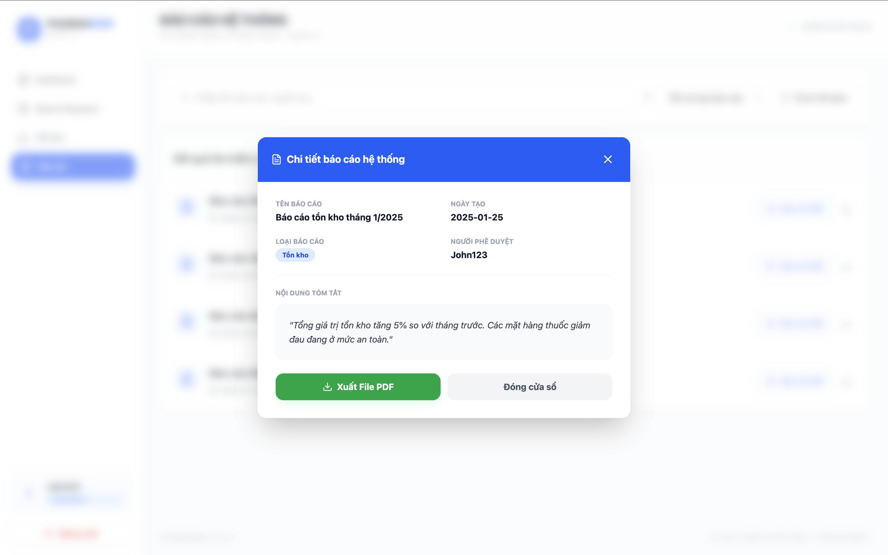

Khi nhấn nút "Xem chi tiết" tại danh sách báo cáo, màn hình ReportDetail xuất hiện cung cấp nội dung tóm tắt và kết quả phân tích kỹ thuật chuyên sâu. Màn hình trình bày rõ rệt lý do biến động dữ liệu và các nhận định về mức độ an toàn của hàng hóa trong kỳ báo cáo cụ thể. Manager có thể thực hiện xuất file PDF chính thức từ giao diện này để trình cấp trên hoặc lưu trữ hồ sơ pháp lý theo quy định.

---

### 2.12 Approve Report Screen

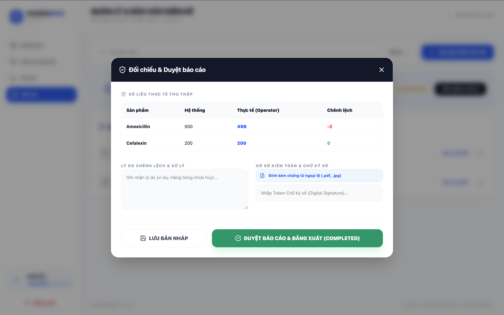

Khi nhấn nút "Đối chiếu & Xử lý" tại màn hình báo cáo, giao diện ApproveReport xuất hiện để Manager phê duyệt kết quả kiểm kê thực tế từ Operator. Màn hình trình bày bảng so sánh chênh lệch chi tiết, khu vực nhập lý do xử lý và ô xác nhận chữ ký số (Digital Signature) phục vụ kiểm toán. Thao tác "Duyệt báo cáo & Đăng xuất" sẽ đánh dấu trạng thái "Completed" cho đợt kiểm kê và hoàn tất quy trình làm việc của quản lý.

### 2.13 Manage User Screen

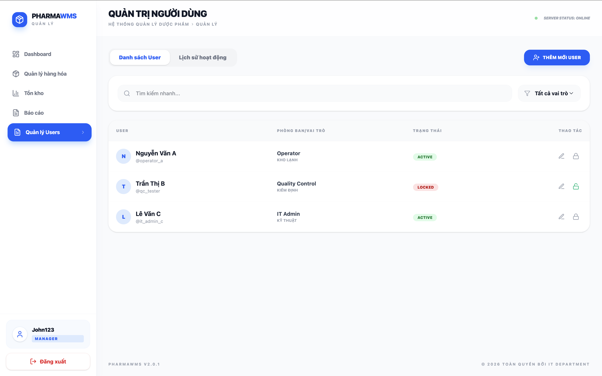

Khi người dùng nhấn vào mục "Quản lý User" trên thanh điều hướng, hệ thống hiển thị giao diện ManageUserScreen mặc định tại tab "Danh sách User" để quản trị tài khoản tập trung. Màn hình cung cấp danh sách nhân viên kèm theo các thông tin định danh, vai trò phòng ban và trạng thái hoạt động trực quan (Active/Locked). Tại đây, Manager có thể thực hiện tìm kiếm nhanh, lọc theo vai trò hoặc sử dụng các biểu tượng thao tác để chỉnh sửa và khóa/mở khóa tài khoản người dùng ngay lập tức.

---

### 2.14 Edit User Screen

Bằng cách nhấn vào biểu tượng chỉnh sửa tại danh sách, giao diện modal EditUser xuất hiện cho phép cập nhật thông tin cá nhân hoặc thay đổi quyền truy cập của nhân viên. Các trường dữ liệu quan trọng như họ tên, email công việc và vai trò hệ thống (Operator, QC...) được bố trí trong biểu mẫu nhập liệu tối giản để đảm bảo tính chính xác. Thao tác "Xác nhận lưu" sẽ ghi nhận các điều chỉnh vào cơ sở dữ liệu và tự động đồng bộ hóa quyền hạn mới cho tài khoản trên toàn hệ thống.

---

### 2.15 User Management History Screen

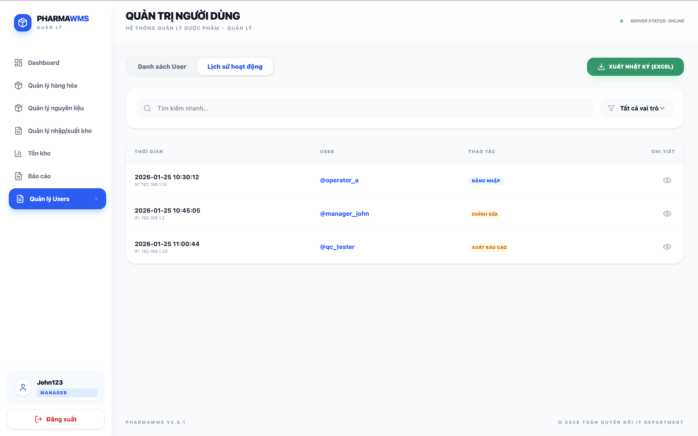

Khi chuyển sang tab "Lịch sử hoạt động", màn hình UserManagementHistory cung cấp nhật ký truy vết chi tiết mọi thao tác để đảm bảo tuân thủ quy định nội bộ và pháp luật. Bảng dữ liệu liệt kê chính xác thời gian ghi nhận, địa chỉ IP kết nối và phân loại hành động như đăng nhập, chỉnh sửa hay xuất báo cáo thông qua các nhãn trạng thái màu sắc. Manager có thể sử dụng tính năng "Xuất nhật ký (Excel)" để trích xuất toàn bộ lịch sử hoạt động phục vụ công tác kiểm tra và kiểm toán định kỳ.

---

### 2.16 User History Detail Screen

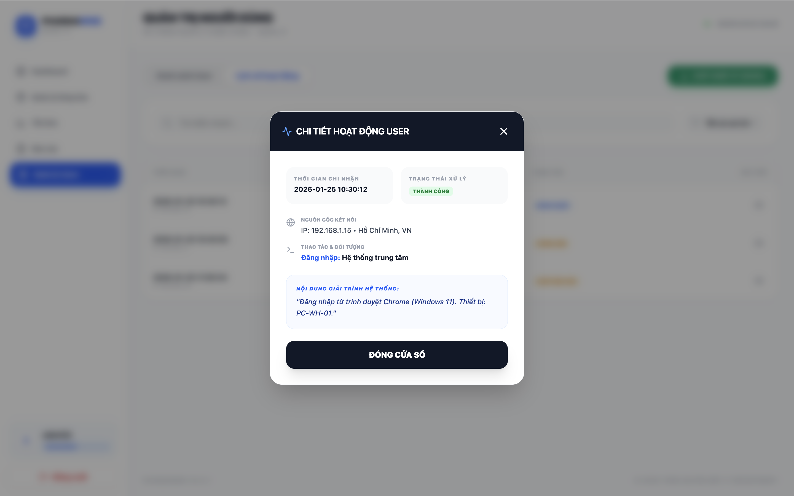

Chọn biểu tượng con mắt tại nhật ký hoạt động sẽ mở ra cửa sổ UserHistoryDetail hiển thị hồ sơ chi tiết của một giao dịch cụ thể. Màn hình cung cấp thông tin chuyên sâu về nguồn gốc kết nối (IP/Vị trí), thiết bị sử dụng và nội dung giải trình hệ thống về các tác động dữ liệu thực tế. Đây là công cụ quan trọng giúp Manager đánh giá mức độ tuân thủ, giải trình các sai lệch dữ liệu hoặc truy vết sự cố kỹ thuật từ phía người dùng.

---

### 2.17 Material Management Screen

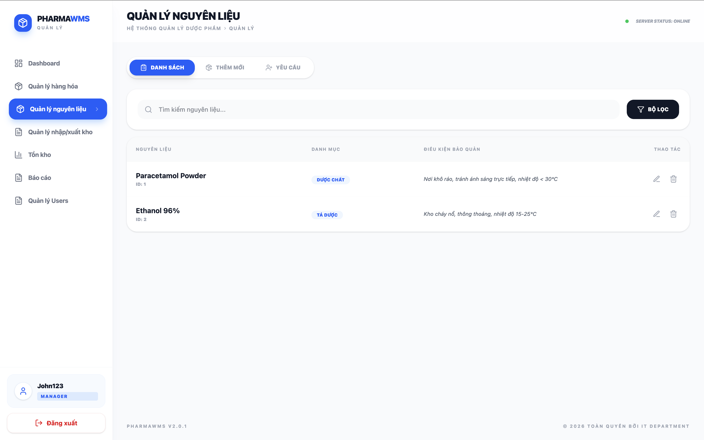

Truy cập mục "Quản lý nguyên liệu" dẫn Manager đến giao diện quản trị danh mục vật tư đầu vào với cấu trúc 3 tab: Danh sách, Thêm mới và Yêu cầu. Màn hình hỗ trợ chuẩn hóa thông tin kỹ thuật, định nghĩa điều kiện bảo quản đặc thù và phê duyệt các đề xuất nguyên liệu mới từ bộ phận Operator. Đây là trục dữ liệu gốc đảm bảo mọi vật tư sử dụng trong sản xuất đều được kiểm soát chặt chẽ từ khâu khai báo.

---

### 2.18 Edit Material Screen

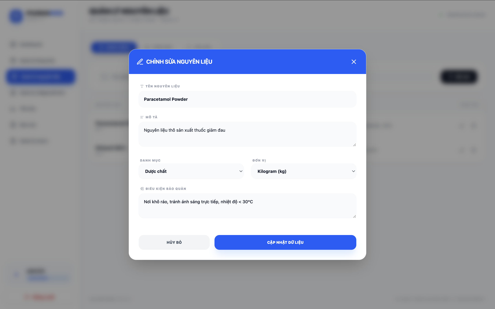

Khi nhấn vào biểu tượng chỉnh sửa tại danh sách nguyên liệu, giao diện modal Edit Material Screen xuất hiện để Manager cập nhật các thông tin kỹ thuật của vật tư. Màn hình cung cấp các trường dữ liệu chi tiết bao gồm tên nguyên liệu, mô tả, phân loại danh mục (Dược chất/Tá dược), đơn vị tính và các điều kiện bảo quản nghiêm ngặt. Thao tác "Cập nhật dữ liệu" giúp ghi nhận các thay đổi vào hệ thống, đảm bảo tính chính xác của dữ liệu gốc phục vụ cho các quy trình nhập kho và sản xuất tiếp theo.

---

### 2.19 Create Material Screen

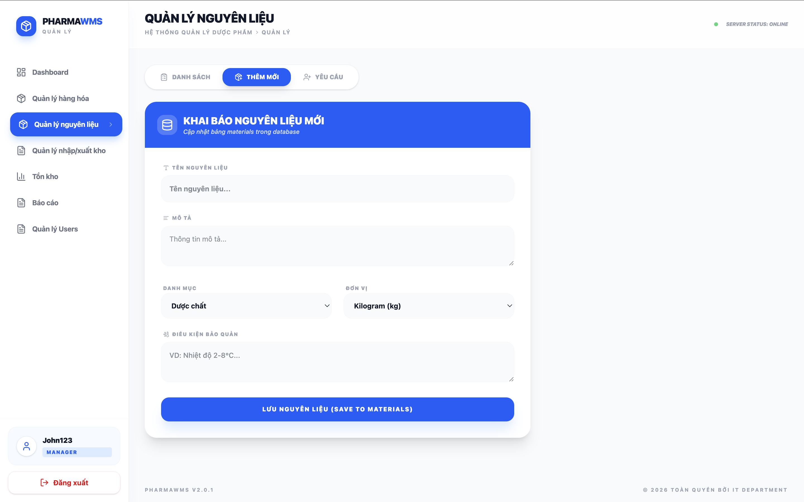

Khi chuyển sang tab "Thêm mới" tại màn hình quản lý nguyên liệu, giao diện Create Material Screen hiển thị để Manager thực hiện khai báo vật tư mới vào hệ thống. Biểu mẫu yêu cầu cung cấp đầy đủ các thông tin kỹ thuật bao gồm tên nguyên liệu, mô tả chi tiết, phân loại danh mục và đơn vị tính tương ứng. Ngoài ra, người dùng cần thiết lập các điều kiện bảo quản tiêu chuẩn để làm căn cứ kiểm soát chất lượng trong suốt quá trình lưu kho. Thao tác "Lưu nguyên liệu" sẽ cập nhật trực tiếp dữ liệu vào bảng materials trong cơ sở dữ liệu.

---

### 2.20 Require Material Screen

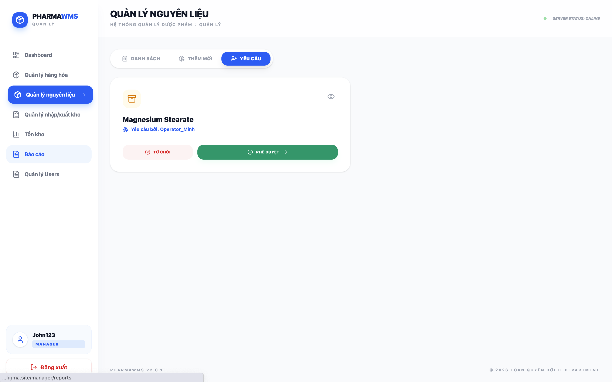

Khi chuyển sang tab "Yêu cầu" tại màn hình quản lý nguyên liệu, giao diện Require Material Screen hiển thị danh sách các đề xuất khởi tạo vật tư mới được gửi từ bộ phận Operator. Mỗi bản ghi cung cấp thông tin tên nguyên liệu đề xuất và định danh nhân viên thực hiện yêu cầu để Manager thuận tiện thẩm định. Tại đây, người quản lý có thể xem chi tiết nội dung hoặc thực hiện các lệnh "Từ chối" hoặc "Phê duyệt" trực tiếp để chính thức ghi nhận vật tư vào danh mục hoạt động của hệ thống.

---

### 2.21 Detail Require Screen

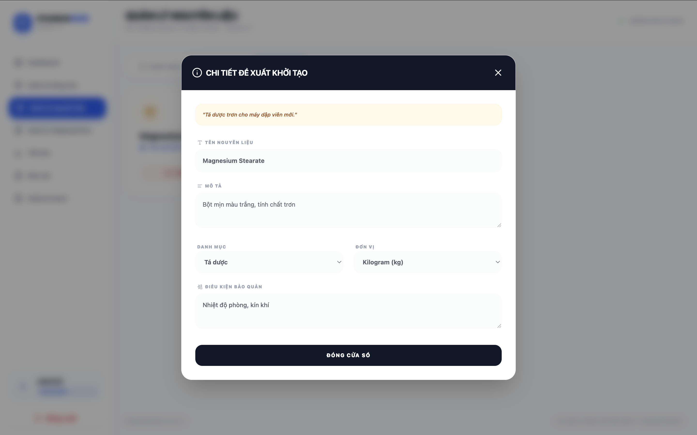

Khi chọn biểu tượng con mắt tại danh sách yêu cầu nguyên liệu, hệ thống hiển thị Detail Require Screen dưới dạng cửa sổ modal để Manager xem xét chi tiết nội dung đề xuất. Màn hình trình bày rõ ràng lý do khởi tạo kèm theo các thông số kỹ thuật dự kiến như tên nguyên liệu, mô tả, danh mục và điều kiện bảo quản tiêu chuẩn. Đây là căn cứ quan trọng để người quản lý đánh giá tính hợp lý trước khi đưa ra quyết định phê duyệt chính thức vào danh mục vật tư của hệ thống.

---

## 3. Operator Screens

### 3.1 Dashboard

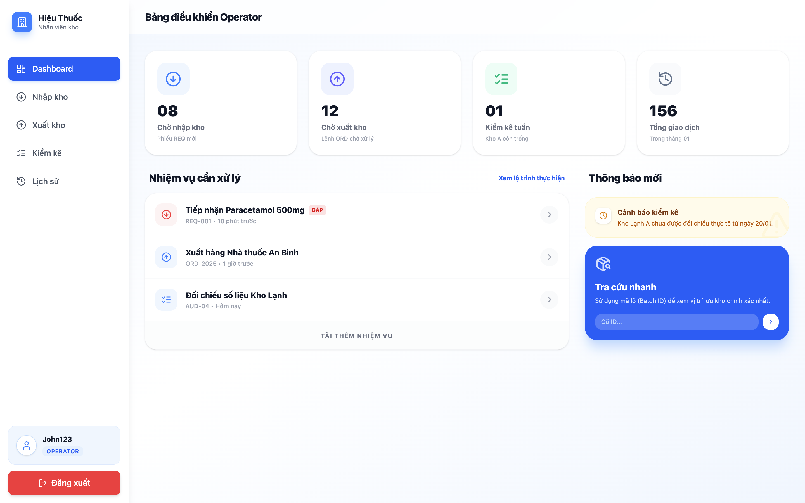

Sau khi đăng nhập với vai trò Operator, hệ thống hiển thị màn hình Dashboard cung cấp số liệu tổng quan về các yêu cầu chờ nhập kho, chờ xuất kho và nhiệm vụ kiểm kê trong tuần. Giao diện liệt kê danh sách các nhiệm vụ khẩn cấp cần xử lý như tiếp nhận hàng hóa hoặc đối chiếu số liệu tại kho lạnh. Ngoài ra, khu vực "Tra cứu nhanh" cho phép nhân viên sử dụng mã lô (Batch ID) để truy vấn vị trí lưu trữ hàng hóa một cách chính xác và tức thời.

---

### 3.2 Import Screen

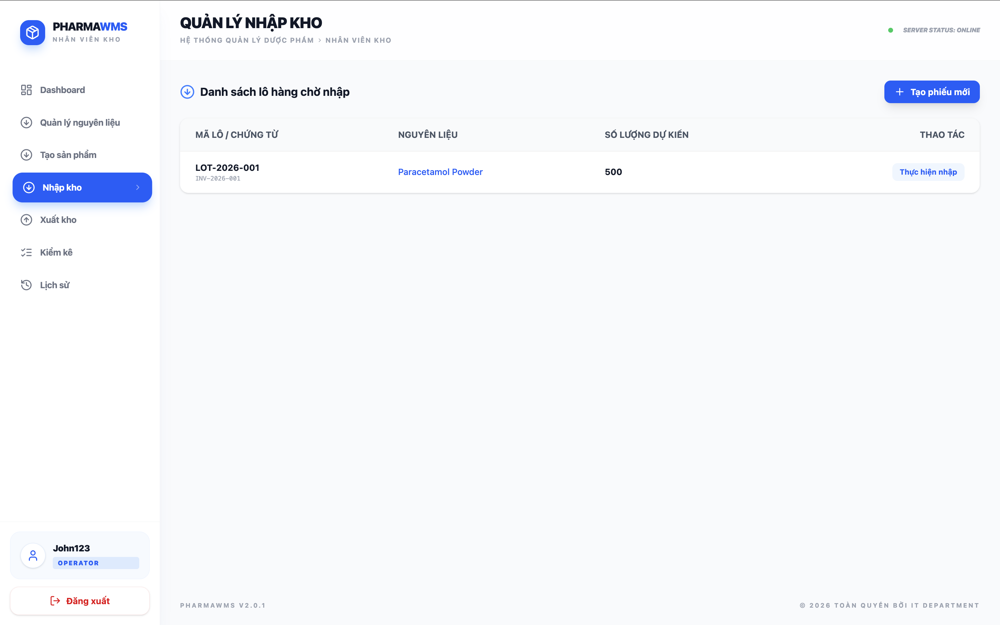

Khi truy cập mục "Nhập kho" trên thanh điều hướng, màn hình ImportScreen xuất hiện hiển thị toàn bộ danh sách các yêu cầu đang chờ xử lý. Bảng dữ liệu cung cấp thông tin về mã chứng từ, tên hàng hóa, số lượng dự kiến và nhà cung cấp tương ứng. Tại đây, nhân viên có thể theo dõi trạng thái của từng lô hàng và thực hiện lệnh nhập kho thông qua cột thao tác.

---

### 3.3 Handling Incoming Goods

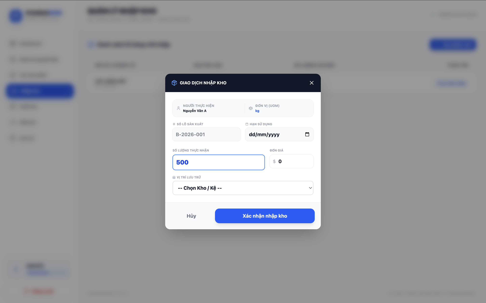

Khi nhấn vào "Thực hiện nhập kho", hệ thống hiển thị cửa sổ modal Handling Incoming Goods Screen để nhân viên ghi nhận thông tin lô hàng và khởi tạo giao dịch Receipt. Giao diện tối ưu hóa quy trình bằng cách tự động điền thông tin Người thực hiện và Đơn vị tính (UOM) lấy từ dữ liệu gốc. Nhân viên chỉ cần cập nhật các thông số thực tế như số lô sản xuất, hạn sử dụng, số lượng thực nhận và đơn giá kèm vị trí lưu trữ cụ thể. Thao tác "Xác nhận nhập kho" giúp lưu trữ hồ sơ lô hàng và đồng bộ biến động tồn kho trên toàn hệ thống.

---

### 3.4 Create a Purchase Order

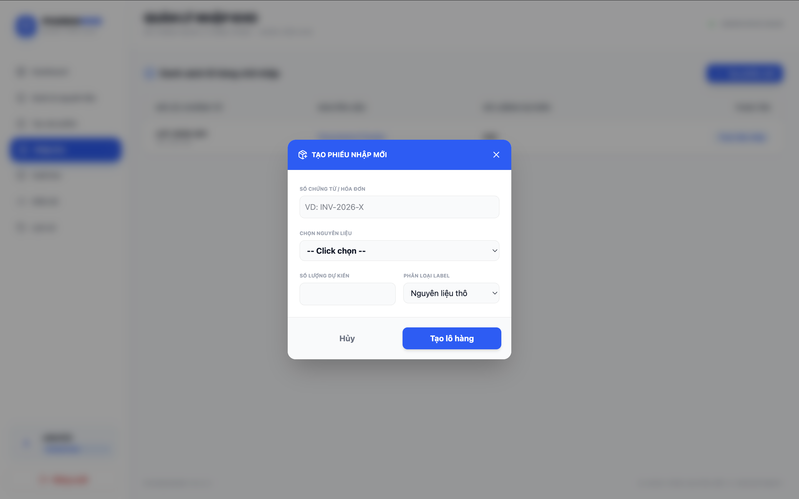

Khi nhấn nút "Tạo phiếu mới", hệ thống hiển thị modal Create A Purchase Order Screen để Operator khởi tạo các lô hàng nhập thủ công. Thay vì nhập tên tự do, nhân viên thực hiện chọn nguyên liệu trực tiếp từ danh mục DB và gán nhãn phân loại (Nguyên liệu thô/Chờ duyệt) để đảm bảo tính nhất quán của dữ liệu. Biểu mẫu yêu cầu cung cấp mã chứng từ kèm số lượng dự kiến, thiết lập tiền đề chính xác cho các bước xử lý nhập kho thực tế tiếp theo.

---

### 3.5 Export Screen

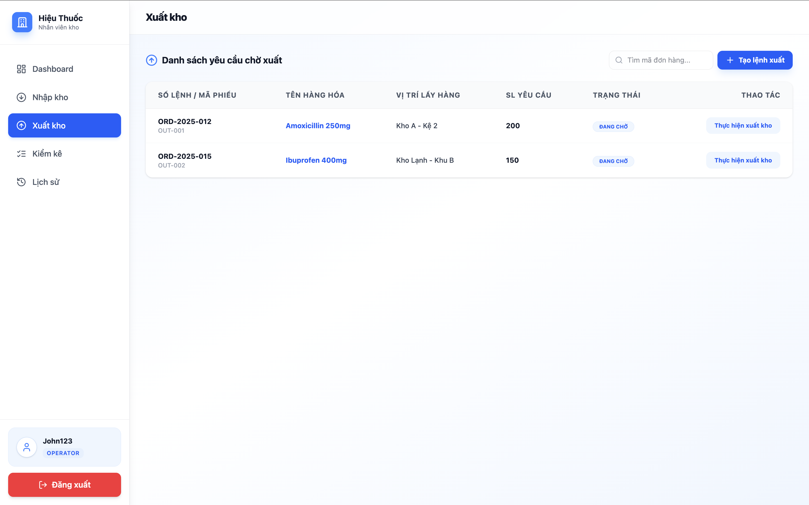

Truy cập mục "Xuất kho" trên navbar dẫn người dùng đến màn hình ExportScreen để quản lý các lệnh lấy hàng từ kho. Giao diện cung cấp lộ trình lấy hàng tối ưu bằng cách hiển thị rõ tên hàng hóa, số lượng yêu cầu và vị trí kệ hàng cụ thể (ví dụ: Kho A - Kệ 2). Nhân viên sử dụng danh sách này để chuẩn bị hàng hóa và chuyển sang bước xác nhận thực hiện xuất kho vật lý.

---

### 3.6 Warehouse Dispatch

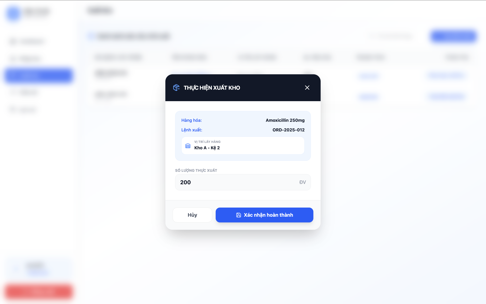

Khi chọn "Thực hiện xuất kho", giao diện modal WarehouseDispatch xuất hiện để nhân viên xác nhận số lượng hàng thực tế đã lấy khỏi kệ. Màn hình hiển thị lại vị trí lấy hàng chính xác để giảm thiểu sai sót trong quá trình vận hành tại các khu vực lưu trữ lớn. Sau khi nhập số lượng thực xuất, thao tác "Xác nhận hoàn thành" sẽ chính thức trừ tồn kho trên hệ thống và lưu lại lịch sử giao dịch.

---

### 3.7 Create a Warehouse Release Order

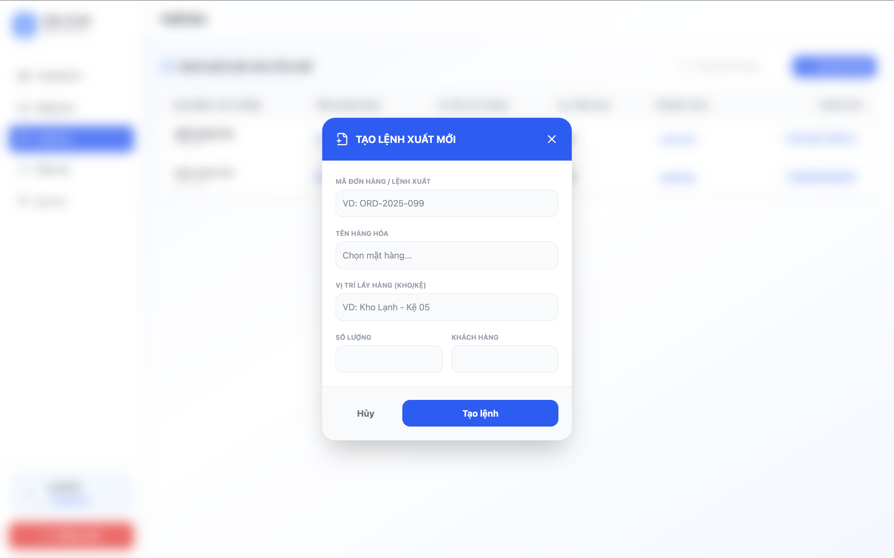

Người dùng chọn "Tạo lệnh xuất" tại màn hình quản lý xuất kho để mở giao diện CreateAWarehouseReleaseOrder khi cần xuất hàng cho khách hàng. Giao diện yêu cầu khai báo chi tiết mã đơn hàng, tên sản phẩm, vị trí lấy hàng và thông tin khách hàng nhận hàng. Việc thiết lập lệnh xuất chính xác giúp hệ thống tự động điều hướng nhân viên đến đúng vị trí lưu trữ của lô hàng đó.

---

### 3.8 Inventory Screen

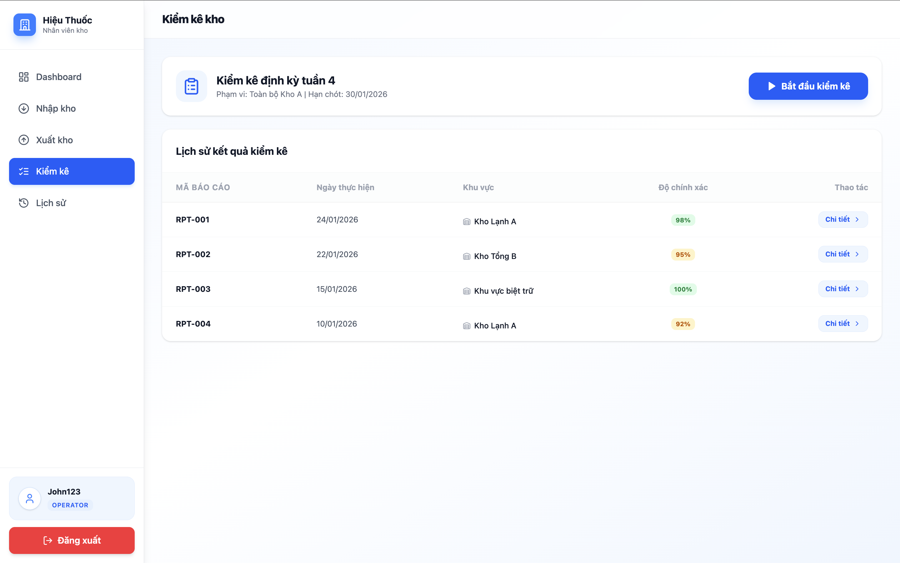

Khi nhấn vào mục "Kiểm kê" trên navbar, hệ thống hiển thị màn hình InventoryScreen liệt kê lịch sử các đợt kiểm kê định kỳ. Nhân viên có thể theo dõi tỷ lệ độ chính xác của các lần kiểm kê trước đó tại từng khu vực như Kho Lạnh A hoặc Kho Tổng B. Nút "Bắt đầu kiểm kê" ở góc trên cùng được sử dụng để khởi tạo một đợt đối soát số liệu thực tế mới theo kế hoạch tuần hoặc tháng.

---

### 3.9 Detail Report

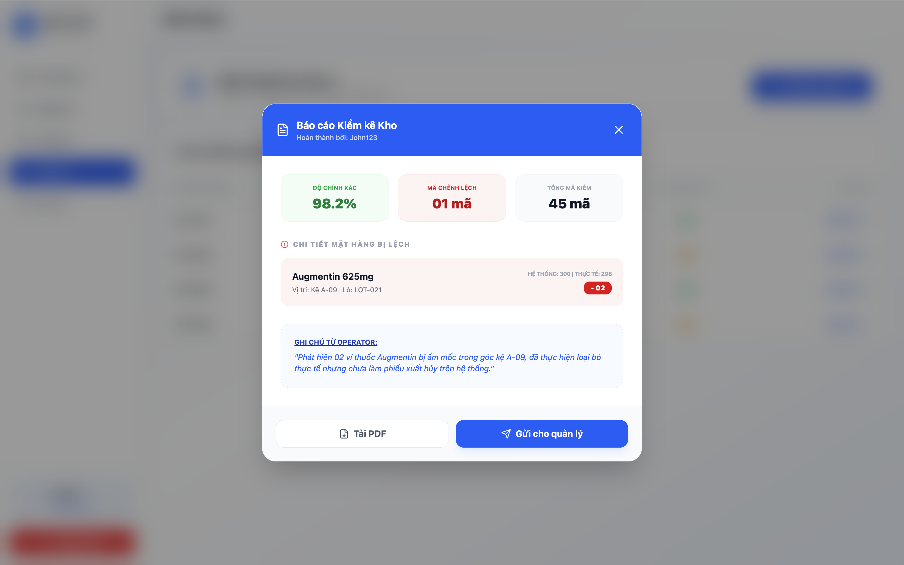

Bằng cách chọn "Chi tiết" tại một bản ghi trong lịch sử kiểm kê, màn hình DetailReport sẽ hiển thị kết quả đối soát cụ thể. Báo cáo cung cấp các chỉ số quan trọng như độ chính xác phần trăm, số lượng mã hàng bị chênh lệch và tổng số mặt hàng đã kiểm tra. Nhân viên có thể xem lý do chênh lệch từ phần ghi chú của Operator và thực hiện tải file PDF hoặc gửi kết quả báo cáo cho cấp quản lý.

---

### 3.10 Inventory Process

Khi nhấn nút "Bắt đầu kiểm kê", hệ thống mở giao diện InventoryProcess để nhân viên thực hiện nhập liệu thực tế tại kho. Danh sách hiển thị số lượng tồn trên hệ thống và các ô input để nhân viên điền con số thực tế đếm được tại từng kệ hàng. Chức năng "Lưu & Đối chiếu ngay" giúp hệ thống tự động tính toán chênh lệch và cập nhật số liệu kho dựa trên kết quả vừa nhập.

---

### 3.11 History Screen

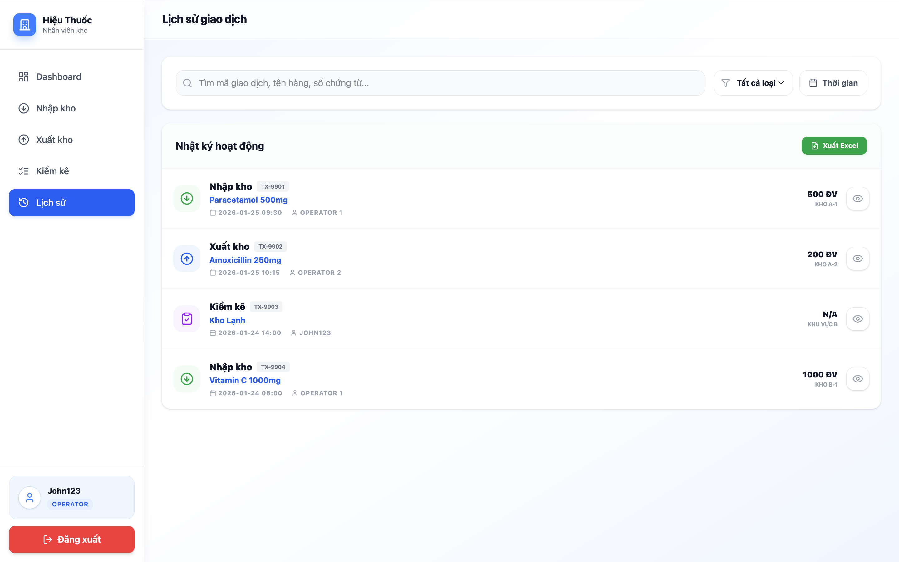

Mục "Lịch sử" trên navbar dẫn đến HistoryScreen, nơi lưu trữ nhật ký hoạt động chi tiết của mọi giao dịch nhập, xuất và kiểm kê. Giao diện hỗ trợ tra cứu linh hoạt theo mã giao dịch hoặc tên hàng, kèm theo tính năng "Xuất Excel" cho toàn bộ nhật ký hoạt động. Mỗi bản ghi hiển thị số lượng, thời gian ghi nhận và định danh nhân viên thực hiện để đảm bảo tính minh bạch dữ liệu.

---

### 3.12 Activity Details

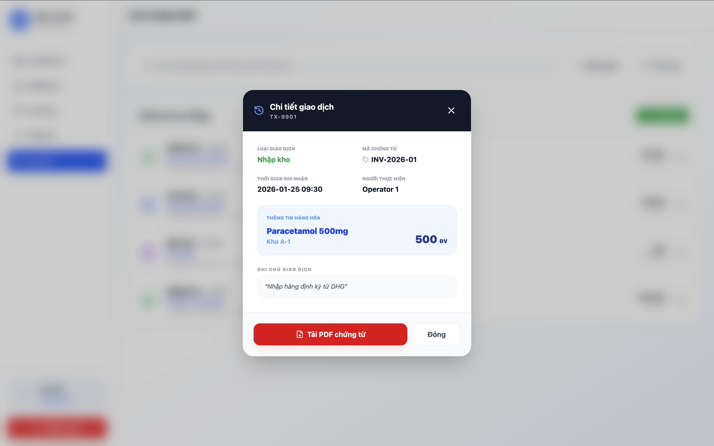

Khi chọn biểu tượng mắt tại nhật ký hoạt động, hệ thống hiển thị ActivityDetails cung cấp hồ sơ đầy đủ về một giao dịch cụ thể. Màn hình liệt kê loại giao dịch, mã chứng từ, thời gian ghi nhận và thông tin chi tiết về hàng hóa cùng vị trí lưu kho. Nút "Tải PDF chứng từ" cho phép người dùng trích xuất văn bản giao dịch để lưu trữ hoặc phục vụ công tác kiểm tra khi cần thiết.

---

### 3.13 Material Management

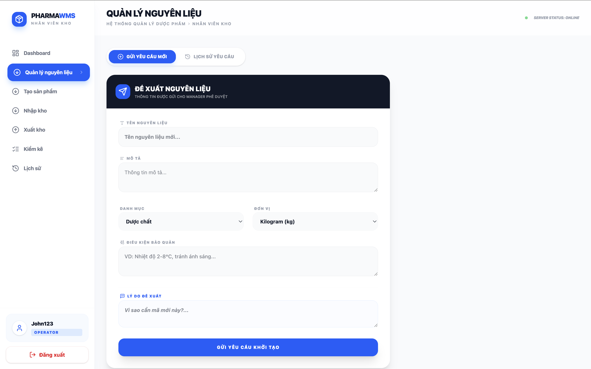

Khi nhấn vào mục "Quản lý nguyên liệu" trên thanh điều hướng, Operator truy cập giao diện đề xuất vật tư mới gồm hai tab: "Gửi yêu cầu mới" và "Lịch sử yêu cầu". Tại tab mặc định, nhân viên thực hiện khai báo đầy đủ thông tin kỹ thuật như tên nguyên liệu, mô tả, danh mục và đơn vị tính. Operator cần thiết lập điều kiện bảo quản và trình bày rõ "Lý do đề xuất" làm căn cứ cho cấp quản lý thẩm định. Thao tác nhấn nút "Gửi yêu cầu khởi tạo" giúp ghi nhận đề xuất vào hệ thống và chuyển trạng thái chờ phê duyệt.

---

### 3.14 Require History

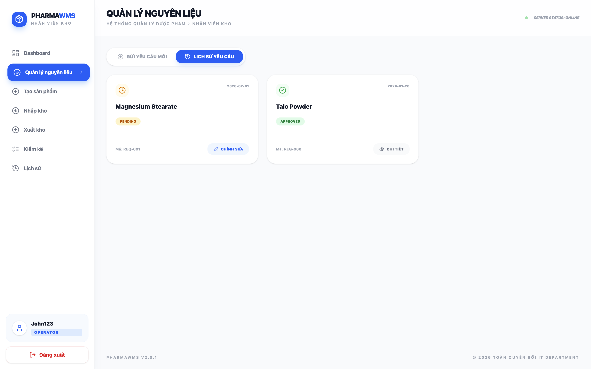

Khi chuyển sang tab "Lịch sử yêu cầu", màn hình Require History Screen hiển thị danh sách các đề xuất nguyên liệu đã gửi kèm trạng thái phê duyệt trực quan (Pending/Approved). Giao diện thực thi nghiêm ngặt logic kiểm soát: Operator chỉ có quyền nhấn "Chỉnh sửa" để cập nhật thông tin đối với các yêu cầu đang ở trạng thái chờ phê duyệt (Pending). Đối với các đề xuất đã được Manager phê duyệt (Approved), hệ thống chỉ cung cấp tùy chọn "Chi tiết" để xem hồ sơ kỹ thuật, nhằm đảm bảo tính toàn vẹn và ngăn chặn các thay đổi ngoài ý muốn đối với dữ liệu vật tư đã chuẩn hóa.

---

### 3.15 Edit Require

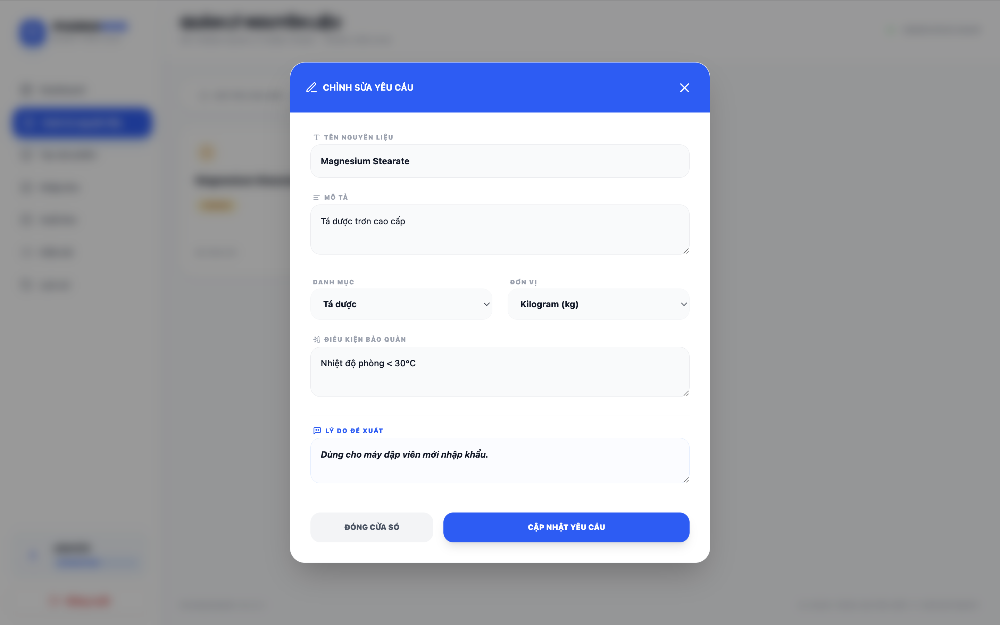

Khi nhấn nút "Chỉnh sửa" tại tab Lịch sử yêu cầu (chỉ khả dụng với trạng thái Pending), giao diện modal Edit Require Screen xuất hiện. Màn hình cho phép Operator cập nhật lại toàn bộ thông tin kỹ thuật và lý do đề xuất của nguyên liệu. Thao tác "Cập nhật yêu cầu" giúp ghi nhận các thay đổi mới nhất vào hệ thống để chuẩn bị cho bước phê duyệt chính thức của Manager.

---

### 3.16 Detail Require

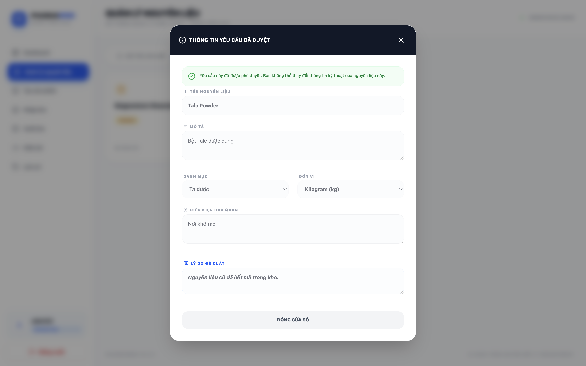

Khi nhấn nút "Chi tiết" tại danh sách các đề xuất đã được phê duyệt, giao diện modal Detail Require Screen hiển thị để Operator xem lại hồ sơ nguyên liệu chính thức. Nhằm đảm bảo tính chuẩn hóa dữ liệu, hệ thống tự động khóa tất cả các trường nhập liệu (chế độ Read-only), không cho phép chỉnh sửa bất kỳ thông tin kỹ thuật nào sau khi Manager đã duyệt. Màn hình cung cấp thông báo xác nhận trạng thái phê duyệt và chỉ cho phép người dùng thực hiện thao tác đóng cửa sổ.

---

### 3.17 Create Product Screen

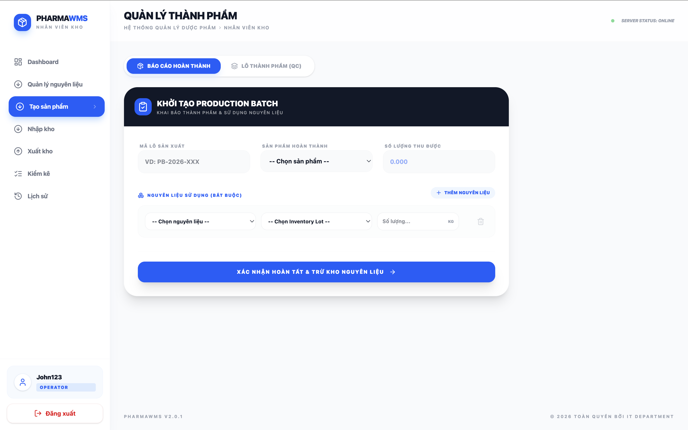

Khi chọn mục "Tạo sản phẩm" trên thanh điều hướng, giao diện Create Product Screen xuất hiện mặc định tại tab "Báo cáo hoàn thành" để Operator khai báo kết quả sản xuất. Màn hình yêu cầu nhập mã lô, chọn thành phẩm và số lượng thu được, kèm theo phần bắt buộc khai báo các Inventory Lot nguyên liệu đã tiêu hao. Thao tác "Xác nhận hoàn tất" giúp khởi tạo lô sản xuất và tự động thực hiện khấu trừ kho nguyên liệu thông qua giao dịch loại usage trên hệ thống.

---

### 3.18 Confirm Create Product Screen

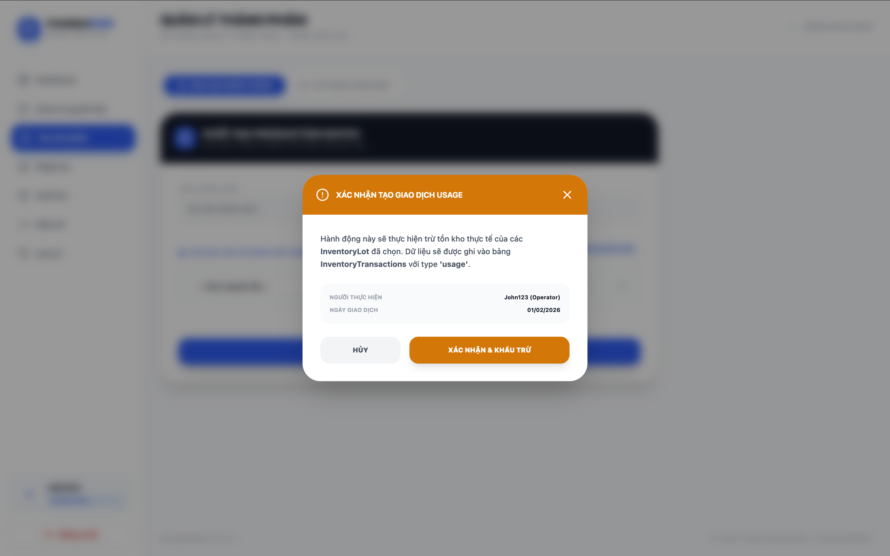

Giao diện modal Confirm Create Product Screen xuất hiện ngay sau khi Operator nhấn hoàn tất báo cáo sản xuất để xác nhận việc khấu trừ nguyên liệu. Màn hình thông báo rõ hành động này sẽ thực hiện trừ tồn kho thực tế của các InventoryLot đã chọn và ghi nhận dữ liệu vào bảng InventoryTransactions với loại giao dịch là 'usage'. Thông tin về Người thực hiện và Ngày giao dịch được hiển thị chi tiết để đảm bảo tính truy vết trước khi nhấn nút "Xác nhận & Khấu trừ" để chính thức cập nhật dữ liệu kho.

---

### 3.19 List Product Screeen

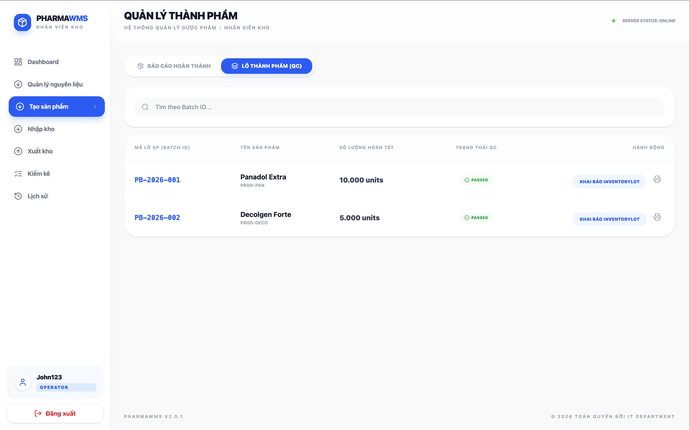

Khi chuyển sang tab "Lô thành phẩm (QC)" tại màn hình quản lý thành phẩm, giao diện List Product Screen hiển thị danh sách các lô hàng đã hoàn tất sản xuất và đạt trạng thái kiểm định chất lượng. Bảng dữ liệu cung cấp thông tin chi tiết về mã lô (Batch ID), số lượng thực tế thu được và nhãn trạng thái "PASSED" từ bộ phận QC. Tại đây, Operator có thể thực hiện "Khai báo InventoryLot" để chính thức nhập lô hàng vào kho lưu trữ hoặc chọn biểu tượng in để tạo nhãn dán truy vết cho sản phẩm.

---

### 3.20 Create Lot Screen

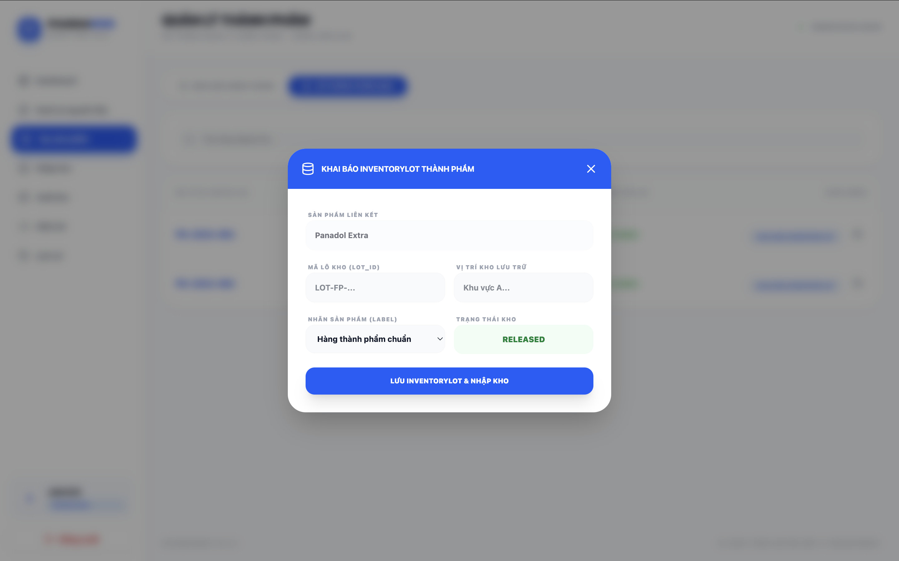

Khi nhấn nút "Khai báo InventoryLot" tại danh sách thành phẩm, giao diện modal Create Lot Screen xuất hiện để Operator khởi tạo bản ghi tồn kho chính thức cho sản phẩm. Màn hình yêu cầu nhập mã lô kho (Lot ID), chỉ định vị trí lưu trữ thực tế và lựa chọn loại nhãn dán sản phẩm phù hợp. Trạng thái kho được hệ thống tự động thiết lập là "RELEASED" dựa trên kết quả kiểm định QC trước đó để sẵn sàng cho các giao dịch xuất kho. Thao tác "Lưu InventoryLot & Nhập kho" hoàn tất việc đưa dữ liệu thành phẩm vào bảng InventoryLots để chính thức bắt đầu quản lý vòng đời hàng hóa.

---

## 4. Quality Control Screens

### 4.1 Dashboard Screen

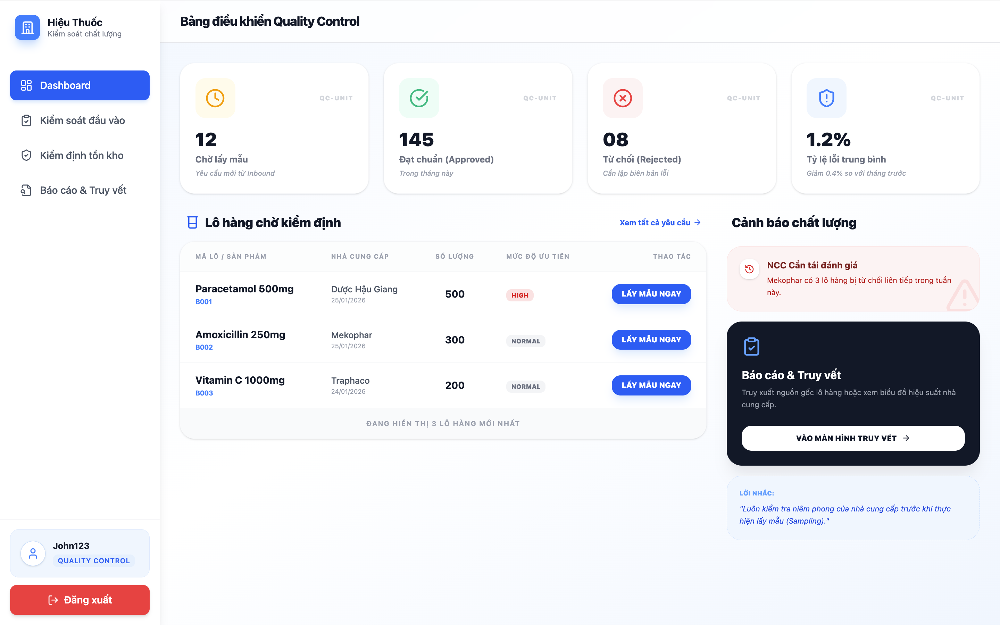

Sau khi đăng nhập với vai trò Quality Control Technician, giao diện DashboardScreen cung cấp cái nhìn tổng quát về khối lượng công việc thông qua các chỉ số như số lô chờ lấy mẫu, số lô đạt chuẩn và tỷ lệ lỗi trung bình. Danh sách các lô hàng mới nhất từ bộ phận Inbound được liệt kê trực quan tại trung tâm, giúp kỹ thuật viên ưu tiên thực hiện lấy mẫu kiểm định ngay. Phía bên phải tích hợp hệ thống cảnh báo về các nhà cung cấp có tỷ lệ lỗi biến động để người dùng chủ động kiểm soát rủi ro chất lượng đầu vào.

---

### 4.2 Inbound Screen

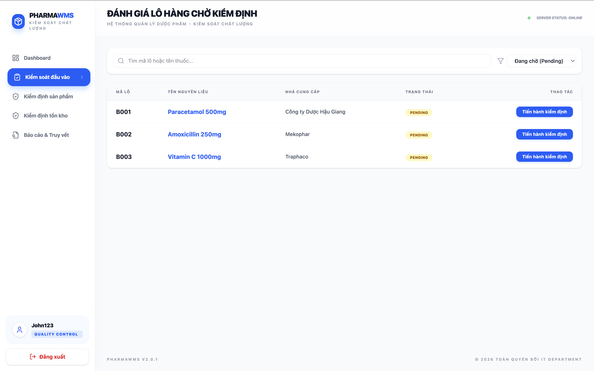

Khi truy cập mục "Kiểm soát đầu vào" trên thanh điều hướng, màn hình InboundScreen hiển thị danh sách toàn bộ các lô nguyên liệu đang ở trạng thái chờ đánh giá chất lượng. Màn hình cung cấp các thông tin định danh quan trọng như mã lô, tên nguyên liệu và nhà cung cấp tương ứng để thuận tiện cho việc tra cứu hồ sơ. Tại đây, kỹ thuật viên có thể sử dụng công cụ lọc để phân loại các lô hàng cần ưu tiên xử lý trước khi tiến hành quy trình kiểm định chuyên sâu.

---

### 4.3 Check Batch

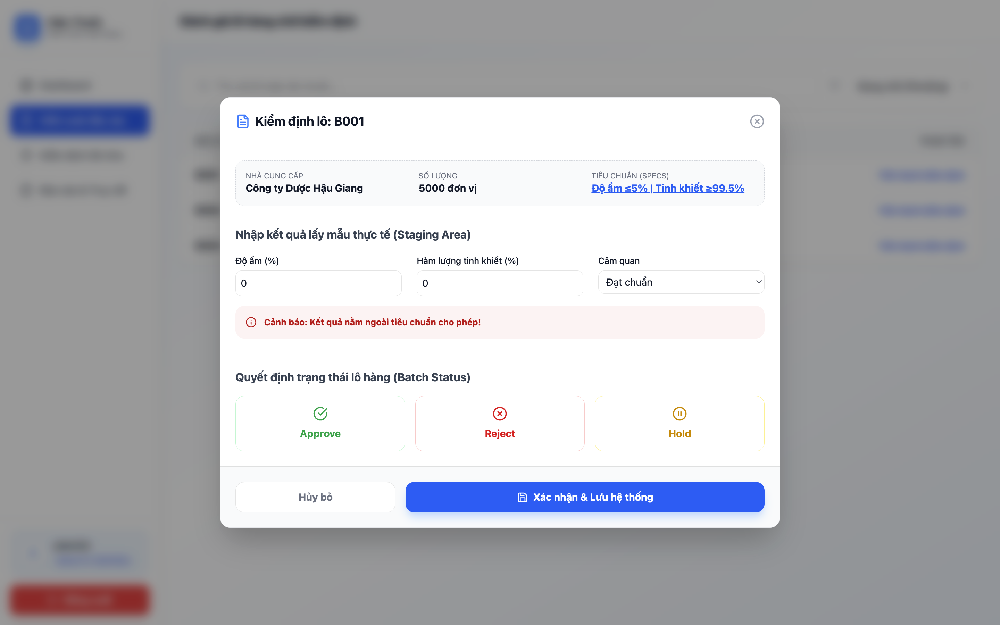

Bằng cách nhấn "Tiến hành kiểm định", hệ thống hiển thị modal để kỹ thuật viên nhập kết quả phân tích thực tế dựa trên các tiêu chuẩn kỹ thuật (Target Specs) có sẵn. Giao diện tích hợp cảnh báo tự động nếu kết quả nằm ngoài ngưỡng cho phép, hỗ trợ người dùng đưa ra quyết định trạng thái và gắn nhãn phân loại lô hàng (Labeling) chính xác. Thao tác "Xác nhận & Cập nhật hệ thống" sẽ chính thức ghi nhận dữ liệu kiểm định, phục vụ cho các bước lưu kho hoặc xuất hủy tiếp theo.

---

### 4.4 Reject Batch

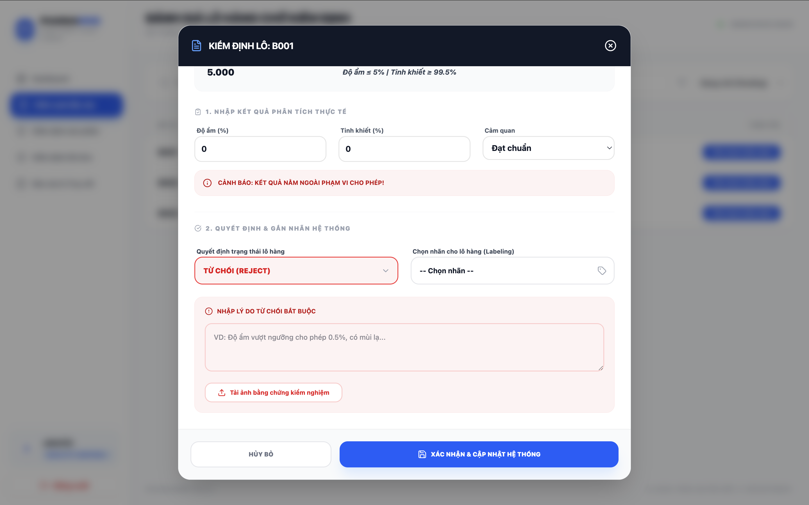

Trong trường hợp chọn quyết định trạng thái là "TỪ CHỐI (REJECT)", giao diện modal sẽ tự động mở rộng thêm các trường thông tin bắt buộc để ghi nhận sự cố. Kỹ thuật viên phải nhập lý do từ chối chi tiết (như độ ẩm vượt ngưỡng hoặc có mùi lạ) và có tùy chọn tải lên ảnh bằng chứng kiểm nghiệm thực tế. Việc thiết lập trạng thái này sẽ cập nhật giá trị status của lô hàng thành "Rejected", đảm bảo tính minh bạch và làm căn cứ pháp lý cho các bước xử lý hàng lỗi tiếp theo.

---

### 4.5 Quality Alert Screen

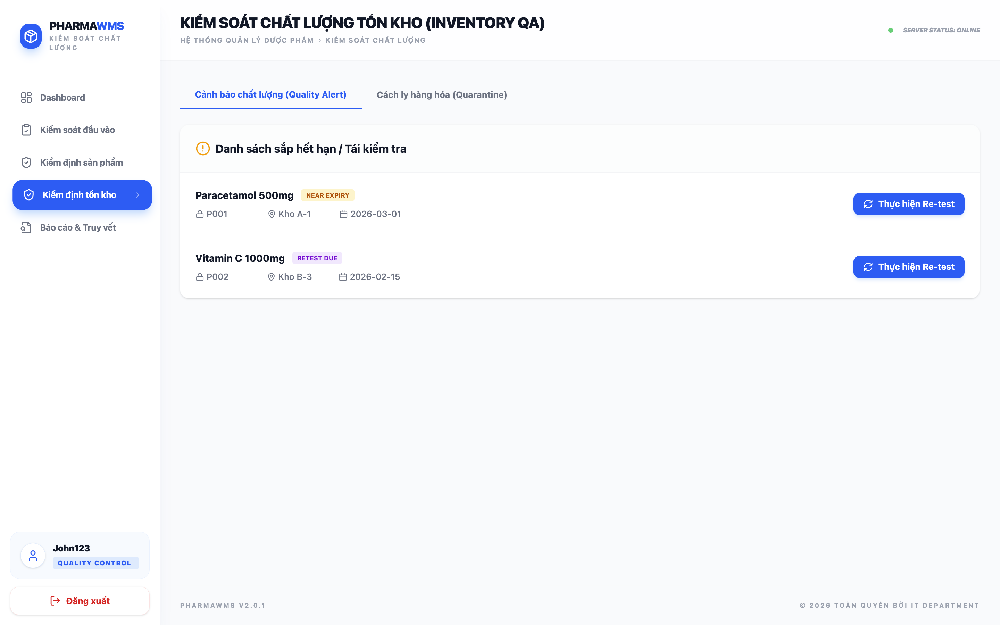

Mục "Kiểm định tồn kho" dẫn đến giao diện quản lý chất lượng hàng hóa lưu kho, mặc định hiển thị danh sách các mặt hàng sắp đến hạn tái kiểm tra. Màn hình phân loại rõ rệt các nhãn trạng thái như "Near Expiry" (sắp hết hạn) hoặc "Retest Due" (đến hạn kiểm định lại) của từng loại thuốc cụ thể. Kỹ thuật viên dựa vào danh sách này để lập kế hoạch lấy mẫu kiểm tra lại tính ổn định của dược phẩm theo đúng quy định bảo quản.

---

### 4.6 Retest Screen

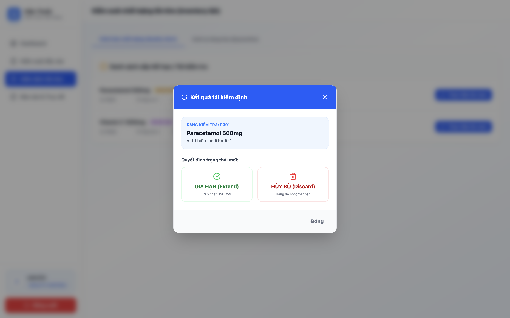

Khi người dùng nhấn "Thực hiện Re-test", giao diện modal xuất hiện hiển thị thông tin sản phẩm và vị trí kho hiện tại của lô hàng cần kiểm tra. Dựa trên kết quả phân tích thực tế, kỹ thuật viên có thể lựa chọn quyết định gia hạn thời gian sử dụng (Extend) hoặc hủy bỏ hoàn toàn lô hàng nếu không còn đạt chuẩn (Discard). Thao tác này giúp cập nhật ngay lập tức hạn sử dụng mới hoặc trạng thái hàng hóa trên toàn bộ hệ thống quản lý tồn kho.

---

### 4.7 Quarantine

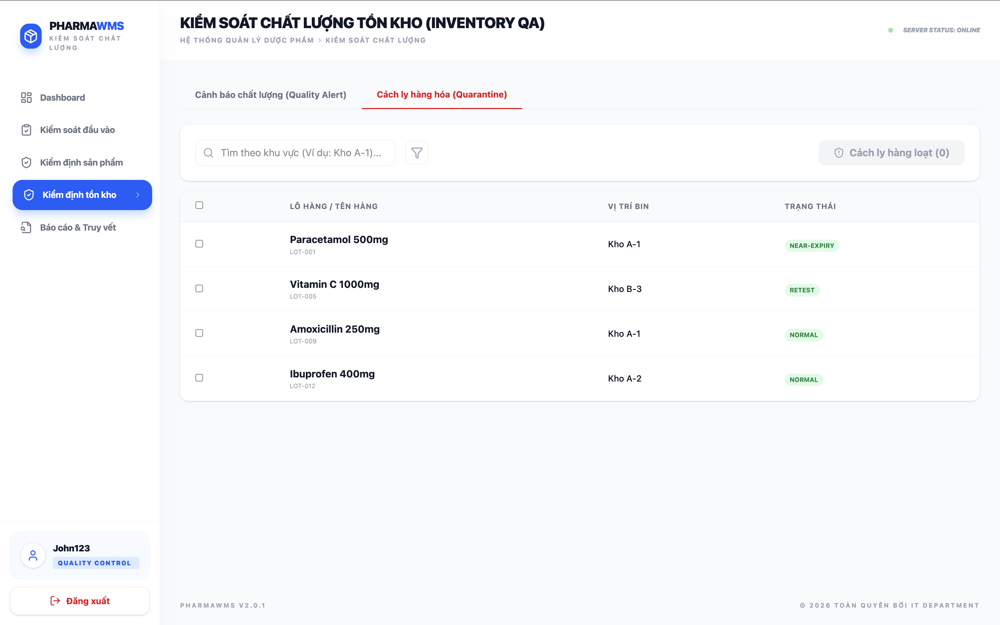

Chuyển sang tab "Cách ly hàng hóa (Quarantine)", người dùng có thể quản lý các lô hàng đang gặp vấn đề về chất lượng hoặc nằm trong diện nghi ngờ rủi ro. Màn hình cho phép chọn nhiều lô hàng cùng lúc để thực hiện lệnh cách ly hàng loạt, ngăn chặn tuyệt đối việc xuất kho các sản phẩm chưa đảm bảo an toàn. Các thông tin về vị trí Bin và trạng thái hiện tại được hiển thị chi tiết để hỗ trợ việc theo dõi và di dời hàng hóa vào khu vực biệt trữ.

---

### 4.8 Report & Traceability Screen

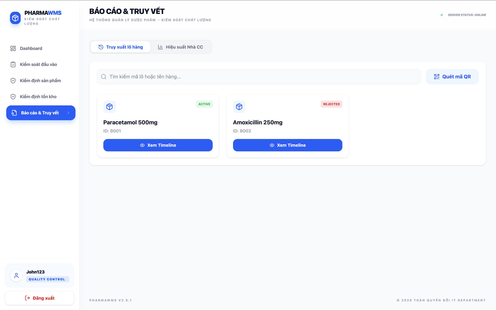

Mục "Báo cáo & Truy vết" hỗ trợ người dùng tìm kiếm nhanh vòng đời của từng lô hàng thông qua mã định danh hoặc tính năng quét mã QR tiện lợi. Giao diện hiển thị các thẻ thông tin tóm tắt về trạng thái hiện hành của sản phẩm như "Active" (đang lưu hành) hoặc "Rejected" (đã bị từ chối). Từ đây, kỹ thuật viên có thể truy cập vào sơ đồ lịch sử chi tiết để phục vụ công tác thanh tra hoặc báo cáo thu hồi sản phẩm.

---

### 4.9 Timeline Traceability

Khi nhấn nút "Xem Timeline", hệ thống cung cấp sơ đồ dòng thời gian ghi lại mọi hoạt động của lô hàng từ lúc nhập kho đến các kỳ tái kiểm định định kỳ. Mỗi bước thực hiện đều hiển thị rõ thời gian chính xác và định danh nhân viên chịu trách nhiệm, đảm bảo tính truy xuất nguồn gốc tuyệt đối cho dược phẩm. Tính năng "Xuất COA (PDF)" được tích hợp sẵn giúp người dùng trích xuất chứng nhận phân tích đạt chuẩn để cung cấp cho các bên liên quan.

---

### 4.10 Efficiency

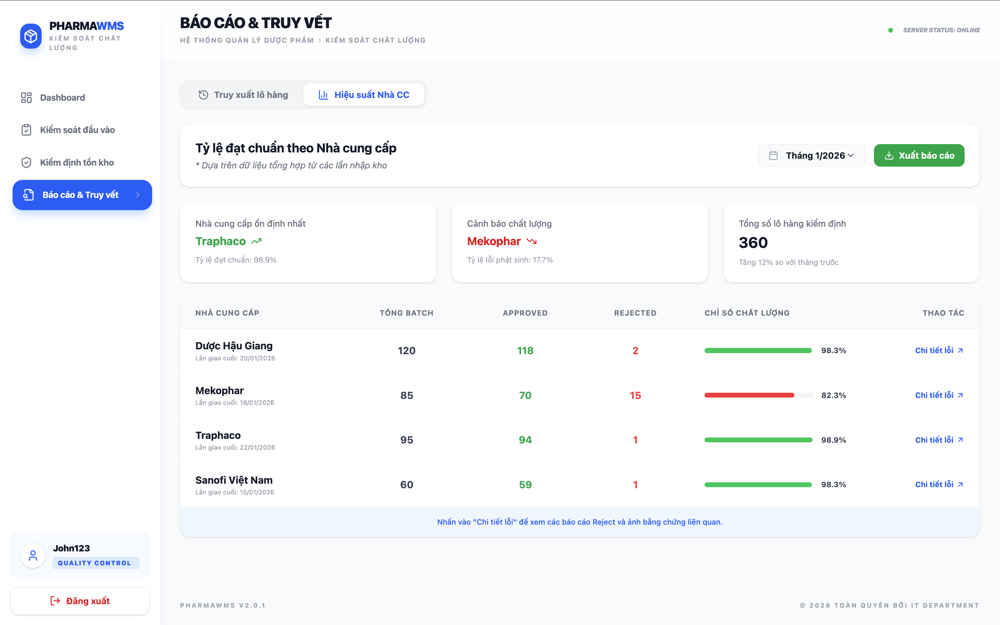

Tab "Hiệu suất Nhà CC" cung cấp bảng thống kê định lượng về chất lượng hàng hóa của từng đơn vị cung ứng dựa trên dữ liệu lịch sử nhập kho. Giao diện sử dụng các biểu đồ thanh và tỷ lệ phần trăm để đánh giá mức độ tin cậy của các đối tác thông qua chỉ số đạt chuẩn (Approved) và từ chối (Rejected). Dữ liệu này là căn cứ khoa học để nhà quản lý đưa ra quyết định tái đánh giá hoặc điều chỉnh kế hoạch thu mua trong chuỗi cung ứng.

---

### 4.11 Error Detail

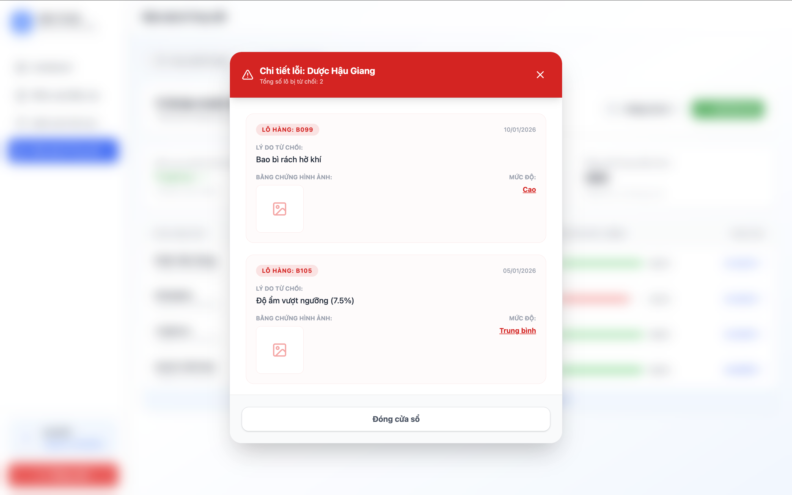

Khi người dùng nhấn vào "Chi tiết lỗi" tại danh sách hiệu suất, hệ thống hiển thị modal ErrorDetail cung cấp hồ sơ cụ thể về các lô hàng bị từ chối. Màn hình liệt kê chi tiết lý do lỗi như bao bì rách hoặc độ ẩm vượt ngưỡng, kèm theo ảnh bằng chứng và mức độ nghiêm trọng của từng sự cố. Thông tin này giúp bộ phận QC có bằng chứng xác thực để làm việc với nhà cung cấp về các vấn đề sai hỏng định kỳ.

---

### 4.12 Check Product

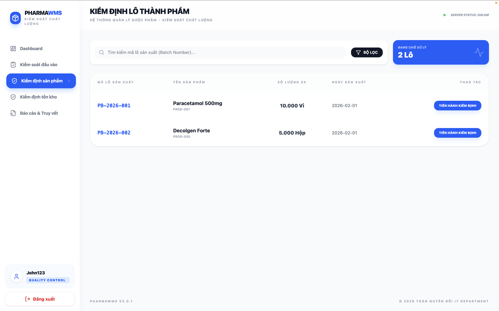

Khi chọn mục "Kiểm định sản phẩm" trên thanh điều hướng, hệ thống hiển thị danh sách các lô thành phẩm (productBatches) đang chờ đánh giá chất lượng trước khi nhập kho. Màn hình cung cấp các thông tin chi tiết về mã lô, tên sản phẩm, số lượng sản xuất và ngày hoàn tất để kỹ thuật viên dễ dàng theo dõi. Người dùng có thể sử dụng bộ lọc tìm kiếm và nhấn nút "Tiến hành kiểm định" để mở giao diện nhập kết quả phân tích kỹ thuật cho từng lô hàng cụ thể.

---

### 4.13 Check Product Process

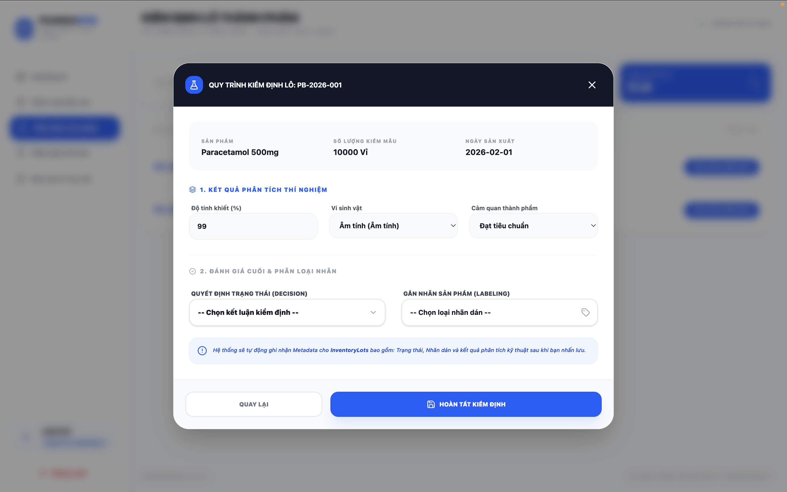

Khi nhấn "Tiến hành kiểm định" từ danh sách, hệ thống hiển thị modal Check Product Process Screen để kỹ thuật viên ghi nhận kết quả thí nghiệm chi tiết cho lô thành phẩm. Giao diện yêu cầu nhập các chỉ số về độ tinh khiết, vi sinh vật và cảm quan, đồng thời thực hiện lựa chọn quyết định trạng thái (Decision) và gán nhãn sản phẩm (Labeling) tương ứng. Thao tác "Hoàn tất kiểm định" sẽ tự động đồng bộ Metadata vào bảng InventoryLots, đảm bảo hồ sơ lô hàng được cập nhật đầy đủ thông tin kỹ thuật trước khi chính thức lưu kho.

---

## 5. IT Administrator Screens

### 5.1 Dashboard Screen

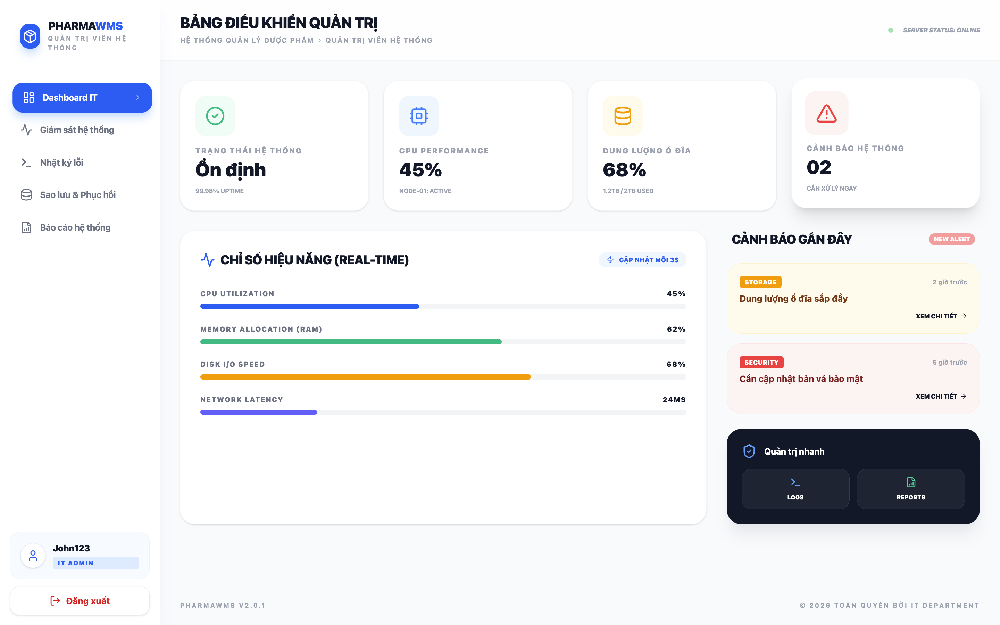

Sau khi đăng nhập với vai trò IT Administrator, hệ thống hiển thị DashboardScreen cung cấp cái nhìn tổng thể về sức khỏe hạ tầng thông qua các chỉ số: trạng thái hệ thống, hiệu suất CPU, dung lượng ổ đĩa và số lượng cảnh báo hiện có. Màn hình tích hợp biểu đồ hiệu năng thời gian thực cho phép theo dõi đồng thời CPU, RAM và độ trễ mạng. Phía bên phải là danh sách các cảnh báo bảo mật và lưu trữ khẩn cấp kèm theo lối tắt quản trị nhanh để truy cập tức thì vào nhật ký hoặc báo cáo.

---

### 5.2 Monitoring Screen

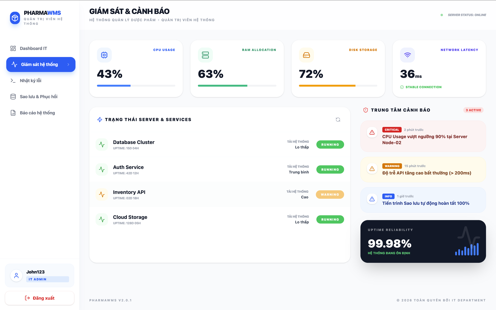

Khi nhấn vào mục "Giám sát hệ thống" trên thanh điều hướng, người dùng truy cập giao diện giám sát chi tiết các thông số tài nguyên máy chủ. Màn hình hiển thị trạng thái vận hành của các dịch vụ cốt lõi như Database Cluster và Auth Service kèm theo mức tải hệ thống tương ứng. Trung tâm cảnh báo phía bên phải liệt kê các sự cố hiệu năng bất thường, giúp kỹ thuật viên chủ động kiểm soát rủi ro thông qua chỉ số tin cậy Uptime Reliability.

---

### 5.3 Logs Screen

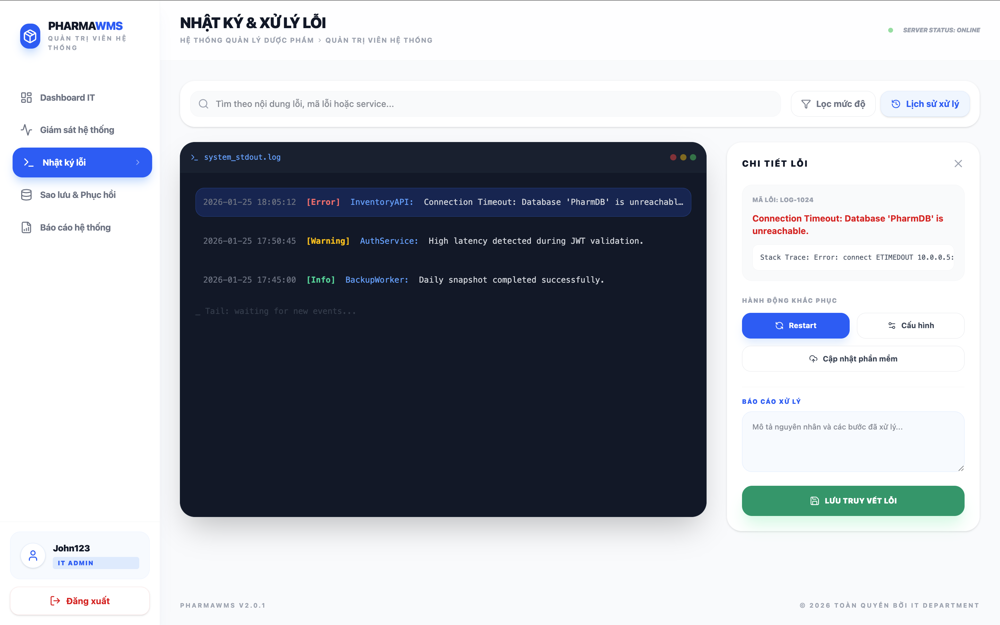

Mục "Nhật kí lỗi" trên navbar dẫn đến giao diện LogsScreen, nơi hiển thị luồng dữ liệu log hệ thống dưới định dạng console chuyên dụng. Khi chọn một dòng lỗi cụ thể, bảng "Chi tiết lỗi" sẽ hiện ra cung cấp mã lỗi và mã nguồn gây lỗi (Stack Trace) để phục vụ phân tích nguyên nhân. Tại đây, quản trị viên có thể thực hiện thao tác khắc phục như Restart service và ghi chú quá trình xử lý vào mục "Báo cáo xử lý" để lưu vết hệ thống.

---

### 5.4 Logs History

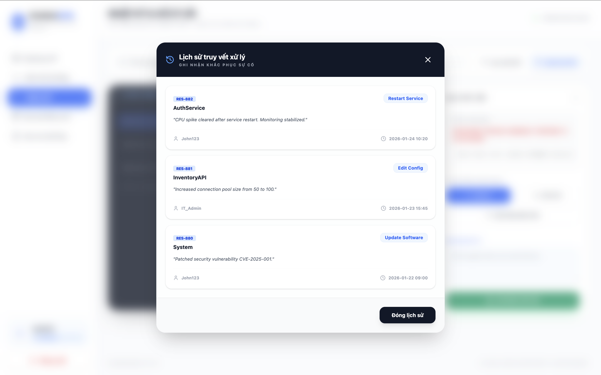

Bằng cách nhấn vào nút "Lịch sử xử lý", hệ thống hiển thị giao diện LogsHistory cung cấp hồ sơ toàn diện về các hoạt động khắc phục sự cố đã thực hiện. Mỗi bản ghi lịch sử liệt kê chi tiết mã truy vết, loại hành động (như Restart hoặc Edit Config), và nội dung giải trình nguyên nhân gốc rễ. Màn hình này đảm bảo tính minh bạch bằng cách ghi nhận chính xác định danh quản trị viên thực hiện và thời gian hoàn thành cho từng vụ việc.

---

### 5.5 Backup Screen

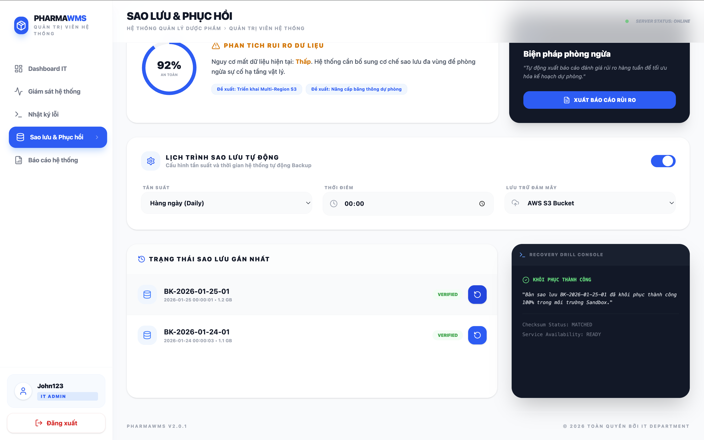

Khi người dùng nhấn vào mục "Sao lưu & Phục hồi" trên thanh điều hướng, giao diện BackupScreen xuất hiện đóng vai trò là trung tâm kiểm soát an toàn dữ liệu tập trung cho hệ thống. Màn hình này cung cấp danh sách nhật ký sao lưu chi tiết kèm theo các nhãn trạng thái trực quan và tính năng "Sandbox Recovery Console" để diễn tập phục hồi dữ liệu trong môi trường giả lập. Quản trị viên có thể chủ động theo dõi các bản ghi lỗi phát sinh hoặc thực hiện lệnh sao lưu thủ công tức thời nhằm đảm bảo hạ tầng PharmaWMS luôn trong trạng thái sẵn sàng ứng phó sự cố.

---

### 5.6 Backup Detail Screen

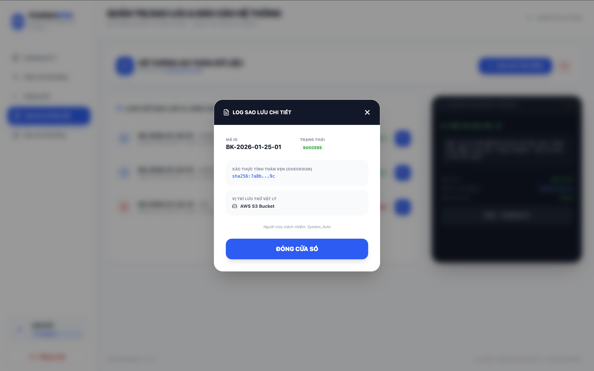

Khi người dùng nhấn vào biểu tượng kính lúp tại danh sách lịch sử, cửa sổ modal BackupDetail hiển thị hồ sơ kỹ thuật chuyên sâu của một bản sao lưu cụ thể. Giao diện cung cấp mã Checksum (sha256) duy nhất để xác thực tính toàn vẹn của dữ liệu và thông tin chính xác về vị trí lưu trữ vật lý như AWS S3 Bucket. Đây là công cụ quan trọng giúp IT Administrator truy vết chính xác định danh người thực hiện và đảm bảo mọi tệp tin sao lưu đều tuân thủ nghiêm ngặt các quy chuẩn an toàn thông tin dược phẩm.

---

### 5.7 Report Screen

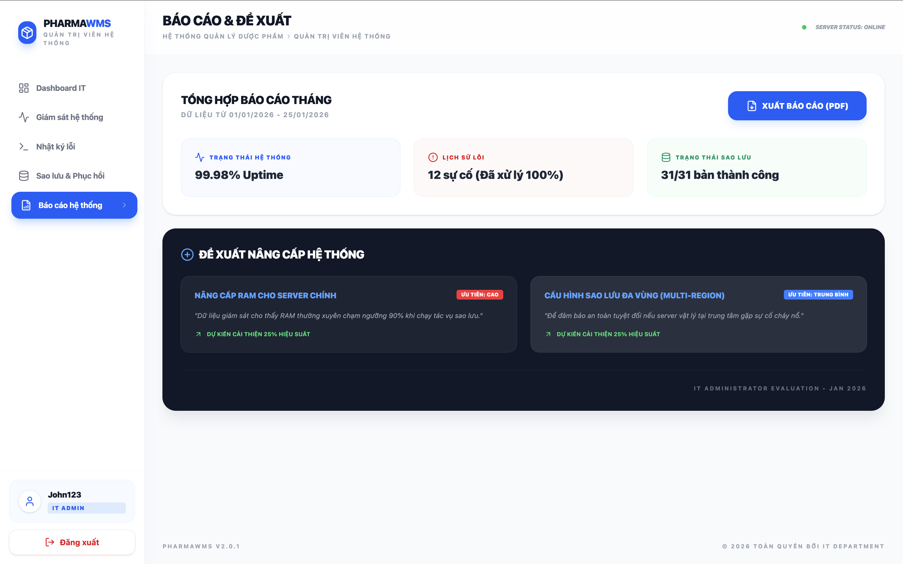

Mục "Báo cáo hệ thống" trên navbar dẫn đến giao diện tổng kết dữ liệu vận hành theo tháng, bao gồm tỷ lệ Uptime, lịch sử sự cố và trạng thái sao lưu. Dựa trên kết quả báo cáo, hệ thống tự động đưa ra các đề xuất cải tiến hạ tầng như nâng cấp RAM hoặc cấu hình sao lưu đa vùng (Multi-Region) kèm theo mức độ ưu tiên xử lý. Người dùng có thể sử dụng nút "XUẤT BÁO CÁO (PDF)" để trích xuất văn bản phục vụ công tác thanh tra hoặc trình phương án nâng cấp hệ thống cho cấp quản lý.
